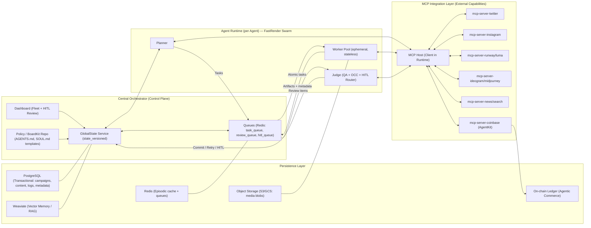
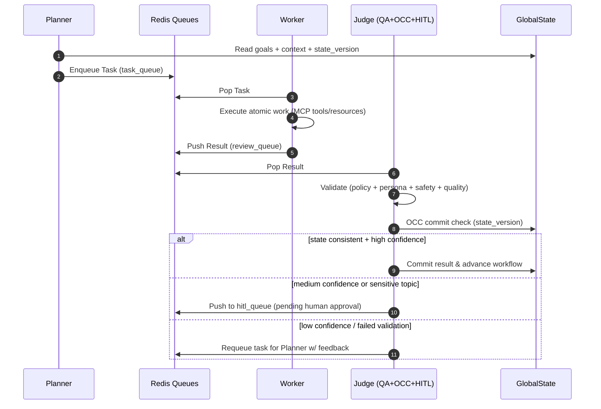
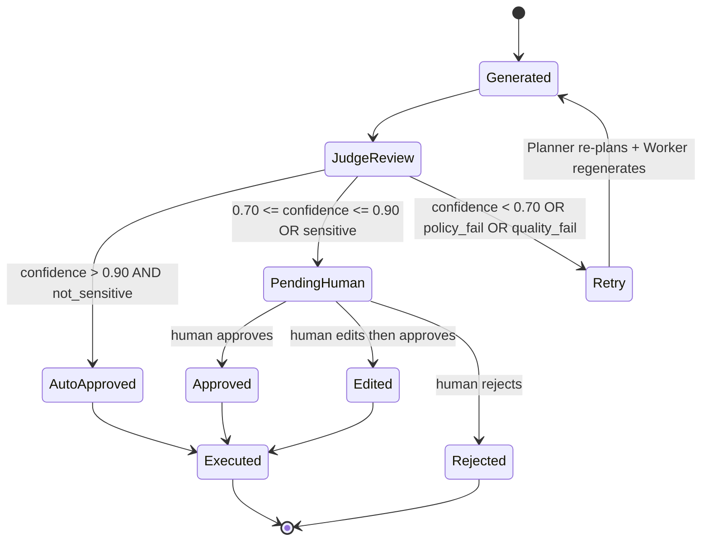
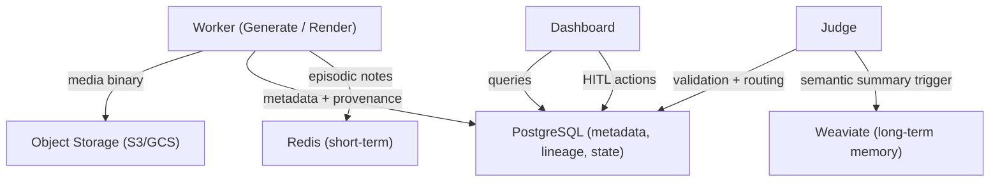

# Project Chimera — Domain Architecture Strategy (Task 1.2)

**Date:** 2026-02-04  
**Scope:** This document finalizes the core domain architecture decisions for **Project Chimera (Autonomous Influencer Network)** before implementation, aligned to the SRS and the 3‑Day Challenge deliverable. "" fileciteturn0file1

---

## 1. Architectural Objectives & Non‑Negotiables

### 1.1 System goals (from the SRS)
- Operate a **fleet (1,000+) of persistent influencer agents** with centralized oversight and strong autonomy at the edge. ""
- Maintain **platform volatility isolation** by routing *all* external interactions via **MCP (Model Context Protocol)**. ""
- Maximize throughput while maintaining quality/safety via **Swarm Architecture** and a **Planner–Worker–Judge** role split. ""
- Enable **management-by-exception**: escalation to human only when confidence/risk thresholds require it. ""

### 1.2 Key constraints to optimize for
- **High‑velocity content** (drafts, variants, renders, posts, engagement loops).
- **Hard governance requirements** (brand safety, sensitive topics, disclosure).
- **Concurrency correctness** across thousands of parallel Workers (avoid ghost updates).
- **Cost governance** (avoid runaway inference / generation / posting / transaction spend).

---

## 2. Reference Architecture Overview

Project Chimera is a **hub-and-spoke** system:
- **Hub:** Central Orchestrator (control plane, dashboards, policy distribution, global state).
- **Spokes:** Agent runtimes that execute tasks using an internal swarm (Planner/Worker/Judge), and interact externally only via MCP Servers. ""

### 2.1 High-level topology (Mermaid)

---

## 3. Decision 1 — Agent Pattern: **Hierarchical Swarm (FastRender) over Sequential Chain**

### 3.1 Options considered
**A) Sequential Chain**  
A single agent (or ordered steps) executes tasks end-to-end (plan → do → verify → publish).

**B) Hierarchical Swarm (Planner–Worker–Judge)**  
A role-based swarm decomposes work, executes in parallel, and enforces quality/governance before commit. ""

### 3.2 Chosen pattern: **Hierarchical Swarm**
The SRS explicitly specifies a FastRender-style swarm with Planner/Worker/Judge roles, optimized for throughput, error recovery, and governance, plus concurrency safety via OCC. ""

#### Why it fits best for Chimera
- **Throughput & parallelism:** Workers are stateless/ephemeral and scale horizontally for bursty workloads (e.g., 50 replies in parallel). ""
- **Governance as a first-class stage:** The Judge is a mandatory gate for policy alignment, quality, and HITL routing. ""
- **Failure isolation:** Workers are “shared-nothing”; failures don’t cascade.
- **State correctness at scale:** Judge implements **Optimistic Concurrency Control (OCC)** with a `state_version` check to prevent “ghost updates.” ""
- **Management by exception:** naturally maps to a human-supervised system where only medium/high-risk outputs are surfaced.

### 3.3 Internal execution semantics (what “hierarchical” means here)
- **Planner** owns goal decomposition and dynamic replanning.
- **Workers** are purely executors of atomic tasks; no inter-worker chatter.
- **Judge** enforces: acceptance criteria, policy constraints, sensitive-topic filters, confidence thresholds, and OCC commit rules. ""

### 3.4 Swarm loop (Mermaid)

### 3.5 Practical implementation notes (architecture-level)
- Define shared schemas for Task/Result/Review items with strict validation (e.g., Pydantic) to reduce ambiguity for agents and services. ""
- Workers should be **idempotent** (safe retries), because OCC failures and retries are expected at scale.
- Split Judges by domain risk:
  - **Content Judge** (text/image/video governance),
  - **CFO Judge** (all transactions), as required by Agentic Commerce governance. ""

---

## 4. Decision 2 — Human-in-the-Loop: **Judge‑routed Safety Layer + Dashboard HITL Queue**

### 4.1 HITL placement in the pipeline
**HITL is not a separate parallel “review team” bolted on later.**  
It is the explicit *routing outcome* of the Judge stage.

In Chimera:
- Workers generate artifacts + a `confidence_score` metadata field.
- Judge applies rules:
  - confidence tier routing
  - sensitive topic hard rules (mandatory human review)
  - policy / persona constraints
- Only then does the system either auto-execute or pause for human approval. ""

### 4.2 Routing policy (as specified)
- **High confidence (> 0.90):** auto-approve and execute.
- **Medium (0.70 – 0.90):** asynchronous human approval (pending).
- **Low (< 0.70):** reject/auto-retry with improved prompt/strategy.
- **Sensitive topics:** mandatory human review regardless of confidence. ""

### 4.3 What humans approve (granular control)
Human approval should happen **at the action boundary**, where the system crosses from “internal generation” to “external effect”:

1) **Publishing actions** (posts, replies, DMs)  
2) **Paid actions** (video generation tiers, ad spends, or any cost-incurring tool call if configured)  
3) **Financial actions** (any on-chain transaction; CFO Judge may still route some small spends to auto-approve if policy allows, but default is conservative) ""

> Design intent: Humans approve *effects*, not intermediate drafts. This keeps autonomy high while maintaining safety.

### 4.4 HITL workflow (Mermaid state machine)

### 4.5 Dashboard responsibilities (what must exist for Day-2+ specs)
The dashboard is “Mission Control” and must include a **Review Interface** for HITL moderators. ""
Minimum features needed to support the architecture:
- Review cards: show artifact (text/image/video link), confidence score, and Judge reasoning trace.
- Approve/Reject/Edit actions that atomically transition state in GlobalState and release held executions.
- Filter/sort by risk type: sensitive topic, low confidence, financial.

### 4.6 Auditability & traceability
For every approval decision, store:
- reviewer id, timestamp
- the exact artifact hash/content snapshot approved
- policy version (from BoardKit/AGENTS.md)
- Judge reasoning trace (redacted as needed)

This aligns with “spec-driven” governance and future compliance requirements.

---

## 5. Decision 3 — Database for High‑Velocity Video Metadata: **SQL (PostgreSQL) as Source of Truth**

### 5.1 What “video metadata” means in Chimera
Video metadata is not just “duration and resolution.” In this domain it includes:
- asset lineage (prompt → renders → edits → final)
- model/tool provenance (which MCP tool, which version, which parameters)
- governance fields (confidence, safety flags, disclosure level)
- publishing state (scheduled/published/failed), platform ids
- performance analytics (views, watch time, engagement deltas)
- cost accounting (generation tier, cost estimates, actual spend)

This is **high cardinality, relational, and governance-heavy**, not just a blob store.

### 5.2 SQL vs NoSQL in this system

#### Option A: NoSQL primary store
Pros:
- high write throughput for event-like ingestion
- flexible schema

Cons (for Chimera’s requirements):
- weaker relational integrity for lineage/traceability
- harder multi-entity queries (campaign ↔ asset ↔ post ↔ platform ↔ analytics)
- governance/audit is typically more complex without strong constraints

#### Option B: SQL primary store (chosen)
Pros:
- strong relational modeling for lifecycle and traceability
- consistent constraints (FKs, enums, checks) for spec-fidelity
- powerful querying for dashboards, reporting, and “why did this post publish?”
- natural fit with the SRS calling out PostgreSQL for transactional data. ""

**Decision:** Use **PostgreSQL** as the **system of record** for video metadata and operational events that require integrity, traceability, and queryability. ""

### 5.3 How PostgreSQL still handles “high velocity”
Use architecture patterns that keep SQL fast under heavy ingest:

- **Partitioning by time** (daily/weekly partitions for high-write tables like `asset_events`, `engagement_metrics`).
- **Append-only event tables** for ingestion; materialize views or summary tables for dashboards.
- **Bulk ingest** via batched inserts / COPY, not row-by-row RPC style.
- **Indexes with intent**:
  - composite indexes for `(agent_id, created_at)`
  - partial indexes for `status IN ('pending','review','failed')`
- **JSONB for tool payload snapshots**, while keeping key query fields normalized (platform, tool_name, tier, etc.).
- **Read scaling** via read replicas for analytics; writes remain primary.

> Optional (not required by the task): if event throughput becomes extreme, add a stream (Kafka/Redpanda) as an ingestion buffer—*but still land canonical metadata in Postgres*.

### 5.4 Storage split: metadata vs media blobs
- **PostgreSQL:** metadata + lineage + governance + publishing state.
- **Object storage (S3/GCS):** the actual media binaries (renders, thumbnails, intermediates).  
This keeps the DB lean and avoids hot tables carrying large BLOBs.

### 5.5 Data layer map (Mermaid)

---

## 6. Concrete Architecture Policies (What we will enforce in code/specs)

### 6.1 “MCP-only external effects”
- **No direct SDK/API calls** from Planner/Worker/Judge to social/video/image/news/chain providers.
- External calls must be via **MCP Tools/Resources**, enabling centralized logging, rate limiting, dry-run, and fast provider swaps. ""

### 6.2 OCC commit discipline (Judge)
Every result commit must include:
- `task_id`, `agent_id`
- `input_state_version`
- `output_state_version` (next)
- `commit_hash` over the artifact + metadata

If the `GlobalState.state_version` has advanced, the Judge **rejects the commit** and requeues for replanning. ""

### 6.3 Confidence scoring as a contract
Every Worker output must include:
- `confidence_score: float`
- `risk_tags: list[str]` (e.g., `["politics","health","finance"]`)
- `disclosure_level` for publishing actions (automated/assisted/none) ""

The Judge is the sole router of these artifacts into:
- auto-execute
- HITL pending
- retry

---

## 7. Summary of Final Decisions

- **Agent Pattern:** Adopt **Hierarchical Swarm (Planner–Worker–Judge)** as the canonical runtime model; it is explicitly specified by the SRS and supports high parallelism + governance + OCC correctness. ""  
- **Human-in-the-Loop:** Implement HITL as a **Judge‑routed Safety Layer** with confidence tiers + sensitive-topic overrides, surfaced through a dashboard **HITL queue** for Approve/Reject/Edit. ""  
- **Database for high‑velocity video metadata:** Use **PostgreSQL (SQL) as the source of truth**, with partitioned append-only event tables, normalized lineage, JSONB payload snapshots, and object storage for blobs. This aligns with the SRS transactional persistence choice and supports governance/traceability. ""

## 8. The highlevel architectural diagram
flowchart TB
  %% Control Plane
  OP["Human Super-Orchestrator"] --> DASH["Orchestrator Dashboard / Mission Control"]
  DASH --> ORCH["Central Orchestrator (Hub) GlobalState + Policies + Multi-tenancy"]

  %% Swarm Core
  ORCH --> PL["Planner Service Builds/updates Task DAG"]
  PL --> TQ[("Task Queue Redis")]
  TQ --> WK["Worker Pool (N) Stateless Executors"]
  WK --> RQ[("Review Queue Redis")]
  RQ --> JD["Judge Service QA + Policy + HITL routing OCC commit gate"]
  JD -->|commit / update| ORCH
  JD -->|retry / replan| PL
  JD -->|escalate| HITL["HITL Review Queue Human Moderators"]
  HITL -->|approve/reject| ORCH

  %% MCP Boundary
  subgraph MCP["MCP Integration Layer (Universal External Interface)"]
    HOST["MCP Host / Client (inside runtime)"]
    TW["mcp-server-twitter Tools/Resources"]
    IG["mcp-server-instagram Tools/Resources"]
    WV["mcp-server-web Tools/Resources"]
    IMG["mcp-server-ideogram/midjourney Generation Tools"]
    VID["mcp-server-runway/luma Generation Tools"]
    CB["mcp-server-coinbase AgentKit Tools"]
  end

  %% Tool usage
  WK --> HOST
  HOST --> TW
  HOST --> IG
  HOST --> WV
  HOST --> IMG
  HOST --> VID
  HOST --> CB