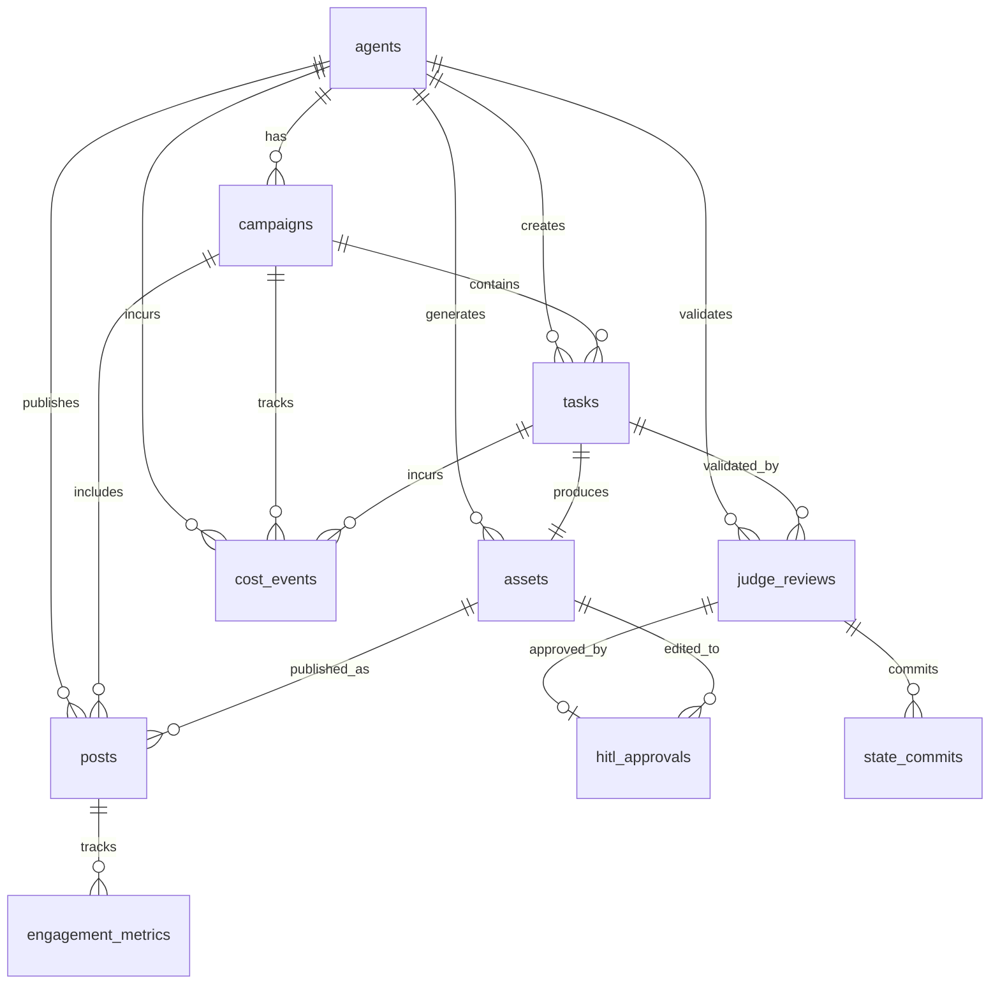

# Project Chimera — Technical Specification

**Date:** 2026-02-04  
**Version:** 1.0  
**Status:** Active

---

## 1. Overview

This document defines API contracts (JSON schemas) and database schema (ERD) for Project Chimera. All APIs use JSON for request/response payloads and are validated using Pydantic models.

---

## 2. API Contracts

### 2.1 Planner API

#### 2.1.1 Decompose Goals

**Endpoint**: `POST /planner/decompose`

**Request Schema**:
```json
{
  "agent_id": "string",
  "goals": [
    {
      "goal_id": "string",
      "description": "string",
      "priority": "high|medium|low",
      "deadline": "ISO8601 datetime (optional)"
    }
  ],
  "context": {
    "state_version": "integer",
    "current_tasks": ["task_id"],
    "episodic_memory": "string (optional)"
  },
  "persona_config": {
    "agent_id": "string",
    "persona_name": "string",
    "policy_version": "string"
  }
}
```

**Response Schema**:
```json
{
  "task_dag": {
    "tasks": [
      {
        "task_id": "string (UUID)",
        "agent_id": "string",
        "task_type": "generate_text|generate_image|render_video|post_content|engage_reply",
        "dependencies": ["task_id"],
        "parameters": {
          "prompt": "string",
          "platform": "twitter|instagram|tiktok",
          "tier": "string (optional, for video generation)",
          "mcp_tool": "string"
        },
        "created_at": "ISO8601 datetime"
      }
    ],
    "edges": [
      {
        "from_task_id": "string",
        "to_task_id": "string"
      }
    ]
  },
  "state_version_snapshot": "integer"
}
```

---

#### 2.1.2 Replan Tasks

**Endpoint**: `POST /planner/replan`

**Request Schema**:
```json
{
  "agent_id": "string",
  "current_state_version": "integer",
  "trigger_reason": "state_changed|goal_updated|external_event",
  "active_tasks": ["task_id"],
  "context_updates": {
    "new_goals": ["goal_id"],
    "cancelled_goals": ["goal_id"],
    "external_events": ["event_description"]
  }
}
```

**Response Schema**:
```json
{
  "updated_task_dag": {
    "tasks": ["task object"],
    "edges": ["edge object"]
  },
  "cancelled_tasks": ["task_id"],
  "new_tasks": ["task_id"],
  "state_version_snapshot": "integer"
}
```

---

### 2.2 Worker API

#### 2.2.1 Execute Task

**Endpoint**: `POST /worker/execute`

**Request Schema**:
```json
{
  "task_id": "string (UUID)",
  "agent_id": "string",
  "task_type": "generate_text|generate_image|render_video|post_content|engage_reply",
  "parameters": {
    "prompt": "string",
    "platform": "string (optional)",
    "tier": "string (optional)",
    "mcp_tool": "string",
    "context": "object (optional)"
  },
  "state_version_snapshot": "integer"
}
```

**Response Schema**:
```json
{
  "result_id": "string (UUID)",
  "task_id": "string",
  "agent_id": "string",
  "artifact": {
    "type": "text|image|video",
    "content": "string (text content or URL to object storage)",
    "metadata": {
      "dimensions": {"width": "integer", "height": "integer"} (for media),
      "duration": "integer (seconds)" (for video),
      "file_size": "integer (bytes)",
      "mime_type": "string"
    }
  },
  "confidence_score": "float (0.0 to 1.0)",
  "risk_tags": ["string"],
  "disclosure_level": "automated|assisted|none",
  "tool_provenance": {
    "mcp_tool": "string",
    "tool_version": "string",
    "parameters_used": "object",
    "cost_estimate": "float (optional)"
  },
  "execution_metadata": {
    "started_at": "ISO8601 datetime",
    "completed_at": "ISO8601 datetime",
    "duration_ms": "integer"
  }
}
```

---

#### 2.2.2 Check Task Status

**Endpoint**: `GET /worker/task/{task_id}/status`

**Response Schema**:
```json
{
  "task_id": "string",
  "status": "pending|executing|completed|failed|cancelled",
  "result_id": "string (optional, if completed)",
  "error": {
    "code": "string",
    "message": "string",
    "stack_trace": "string (optional)"
  } (optional, if failed)
}
```

---

### 2.3 Judge API

#### 2.3.1 Validate Result

**Endpoint**: `POST /judge/validate`

**Request Schema**:
```json
{
  "result_id": "string (UUID)",
  "task_id": "string",
  "agent_id": "string",
  "artifact": {
    "type": "text|image|video",
    "content": "string",
    "metadata": "object"
  },
  "confidence_score": "float",
  "risk_tags": ["string"],
  "disclosure_level": "string",
  "tool_provenance": "object",
  "input_state_version": "integer"
}
```

**Response Schema**:
```json
{
  "review_id": "string (UUID)",
  "result_id": "string",
  "validation_result": {
    "quality_score": "float (0.0 to 1.0)",
    "policy_compliant": "boolean",
    "sensitive_topics_detected": ["string"],
    "violations": [
      {
        "rule": "string",
        "severity": "critical|warning|info",
        "message": "string"
      }
    ]
  },
  "routing_decision": {
    "action": "auto_execute|hitl_queue|retry",
    "reason": "string",
    "confidence_tier": "high|medium|low"
  },
  "occ_check": {
    "input_state_version": "integer",
    "current_state_version": "integer",
    "consistent": "boolean"
  }
}
```

---

#### 2.3.2 Commit Result (OCC)

**Endpoint**: `POST /judge/commit`

**Request Schema**:
```json
{
  "review_id": "string (UUID)",
  "result_id": "string",
  "agent_id": "string",
  "task_id": "string",
  "input_state_version": "integer",
  "output_state_version": "integer",
  "commit_hash": "string (SHA-256 of artifact + metadata)",
  "routing_decision": {
    "action": "auto_execute|hitl_queue|retry"
  }
}
```

**Response Schema**:
```json
{
  "commit_id": "string (UUID)",
  "committed": "boolean",
  "new_state_version": "integer",
  "error": {
    "code": "occ_conflict|validation_failed|internal_error",
    "message": "string"
  } (optional, if commit failed)
}
```

---

#### 2.3.3 CFO Judge: Validate Transaction

**Endpoint**: `POST /judge/cfo/validate-transaction`

**Request Schema**:
```json
{
  "transaction_request": {
    "agent_id": "string",
    "campaign_id": "string (optional)",
    "amount": "float",
    "currency": "string",
    "purpose": "string",
    "recipient": "string",
    "on_chain": "boolean"
  },
  "budget_context": {
    "agent_budget_remaining": "float",
    "campaign_budget_remaining": "float (optional)",
    "global_budget_remaining": "float"
  }
}
```

**Response Schema**:
```json
{
  "approval_id": "string (UUID)",
  "approved": "boolean",
  "reason": "string",
  "budget_updates": {
    "agent_budget_remaining": "float",
    "campaign_budget_remaining": "float (optional)",
    "global_budget_remaining": "float"
  }
}
```

---

### 2.4 GlobalState API

#### 2.4.1 Read State

**Endpoint**: `GET /globalstate/{agent_id}`

**Response Schema**:
```json
{
  "agent_id": "string",
  "state_version": "integer",
  "goals": [
    {
      "goal_id": "string",
      "description": "string",
      "status": "active|completed|cancelled",
      "priority": "string"
    }
  ],
  "active_tasks": ["task_id"],
  "campaigns": [
    {
      "campaign_id": "string",
      "name": "string",
      "status": "active|paused|completed",
      "budget_remaining": "float"
    }
  ],
  "persona_config": {
    "agent_id": "string",
    "persona_name": "string",
    "policy_version": "string",
    "last_updated": "ISO8601 datetime"
  }
}
```

---

#### 2.4.2 Update State (OCC)

**Endpoint**: `POST /globalstate/update`

**Request Schema**:
```json
{
  "agent_id": "string",
  "input_state_version": "integer",
  "updates": {
    "goals": [
      {
        "action": "add|update|remove",
        "goal": "goal object"
      }
    ],
    "campaigns": [
      {
        "action": "add|update|remove",
        "campaign": "campaign object"
      }
    ]
  },
  "commit_hash": "string"
}
```

**Response Schema**:
```json
{
  "updated": "boolean",
  "new_state_version": "integer",
  "error": {
    "code": "occ_conflict|validation_failed",
    "message": "string"
  } (optional, if update failed)
}
```

---

### 2.5 Dashboard API

#### 2.5.1 Get HITL Queue

**Endpoint**: `GET /dashboard/hitl-queue`

**Query Parameters**:
- `filter`: `all|sensitive|low_confidence|financial` (default: `all`)
- `limit`: `integer` (default: 50)
- `offset`: `integer` (default: 0)

**Response Schema**:
```json
{
  "items": [
    {
      "review_id": "string (UUID)",
      "result_id": "string",
      "agent_id": "string",
      "artifact": {
        "type": "text|image|video",
        "content": "string",
        "preview_url": "string (for media)"
      },
      "confidence_score": "float",
      "risk_tags": ["string"],
      "judge_reasoning": "string",
      "created_at": "ISO8601 datetime",
      "pending_since": "ISO8601 datetime"
    }
  ],
  "total_count": "integer",
  "has_more": "boolean"
}
```

---

#### 2.5.2 Approve HITL Item

**Endpoint**: `POST /dashboard/hitl-queue/{review_id}/approve`

**Request Schema**:
```json
{
  "reviewer_id": "string",
  "notes": "string (optional)"
}
```

**Response Schema**:
```json
{
  "approval_id": "string (UUID)",
  "approved": "boolean",
  "execution_released": "boolean",
  "new_state_version": "integer"
}
```

---

#### 2.5.3 Reject HITL Item

**Endpoint**: `POST /dashboard/hitl-queue/{review_id}/reject`

**Request Schema**:
```json
{
  "reviewer_id": "string",
  "reason": "string"
}
```

**Response Schema**:
```json
{
  "rejection_id": "string (UUID)",
  "rejected": "boolean",
  "workflow_terminated": "boolean"
}
```

---

#### 2.5.4 Edit HITL Item

**Endpoint**: `POST /dashboard/hitl-queue/{review_id}/edit`

**Request Schema**:
```json
{
  "reviewer_id": "string",
  "edits": {
    "artifact": {
      "type": "text|image|video",
      "content": "string (edited content)"
    },
    "notes": "string (optional)"
  }
}
```

**Response Schema**:
```json
{
  "edit_id": "string (UUID)",
  "edited_artifact_id": "string",
  "requires_revalidation": "boolean",
  "new_review_id": "string (UUID, if revalidation required)"
}
```

---

#### 2.5.5 Get Fleet Status

**Endpoint**: `GET /dashboard/fleet-status`

**Response Schema**:
```json
{
  "fleet_overview": {
    "total_agents": "integer",
    "active_agents": "integer",
    "idle_agents": "integer",
    "error_agents": "integer"
  },
  "queue_depths": {
    "task_queue": "integer",
    "review_queue": "integer",
    "hitl_queue": "integer"
  },
  "error_rates": {
    "last_hour": "float",
    "last_24_hours": "float"
  },
  "recent_errors": [
    {
      "error_id": "string",
      "agent_id": "string",
      "error_type": "string",
      "message": "string",
      "timestamp": "ISO8601 datetime"
    }
  ]
}
```

---

#### 2.5.6 Get Cost Metrics

**Endpoint**: `GET /dashboard/cost-metrics`

**Query Parameters**:
- `agent_id`: `string (optional)`
- `campaign_id`: `string (optional)`
- `start_date`: `ISO8601 date`
- `end_date`: `ISO8601 date`

**Response Schema**:
```json
{
  "total_cost": "float",
  "cost_by_category": {
    "inference": "float",
    "generation": "float",
    "posting": "float",
    "transactions": "float"
  },
  "cost_by_agent": [
    {
      "agent_id": "string",
      "total_cost": "float",
      "cost_per_engagement": "float"
    }
  ],
  "cost_trends": [
    {
      "date": "ISO8601 date",
      "total_cost": "float"
    }
  ],
  "budget_status": {
    "global_budget_remaining": "float",
    "global_budget_limit": "float",
    "percentage_used": "float"
  }
}
```

---

## 3. Database Schema (ERD)

### 3.1 Core Tables

#### 3.1.1 `agents`

Primary entity representing an influencer agent.

```sql
CREATE TABLE agents (
    agent_id VARCHAR(255) PRIMARY KEY,
    persona_name VARCHAR(255) NOT NULL,
    policy_version VARCHAR(50) NOT NULL,
    state_version INTEGER NOT NULL DEFAULT 0,
    status VARCHAR(50) NOT NULL DEFAULT 'active', -- active, paused, deleted
    created_at TIMESTAMP WITH TIME ZONE NOT NULL DEFAULT NOW(),
    updated_at TIMESTAMP WITH TIME ZONE NOT NULL DEFAULT NOW(),
    persona_config JSONB NOT NULL, -- Full persona configuration from AGENTS.md/SOUL.md
    INDEX idx_agents_status (status),
    INDEX idx_agents_state_version (state_version)
);
```

---

#### 3.1.2 `campaigns`

Campaigns represent high-level goals or content series for agents.

```sql
CREATE TABLE campaigns (
    campaign_id VARCHAR(255) PRIMARY KEY,
    agent_id VARCHAR(255) NOT NULL REFERENCES agents(agent_id) ON DELETE CASCADE,
    name VARCHAR(255) NOT NULL,
    description TEXT,
    status VARCHAR(50) NOT NULL DEFAULT 'active', -- active, paused, completed
    budget_limit DECIMAL(10, 2),
    budget_remaining DECIMAL(10, 2),
    created_at TIMESTAMP WITH TIME ZONE NOT NULL DEFAULT NOW(),
    updated_at TIMESTAMP WITH TIME ZONE NOT NULL DEFAULT NOW(),
    INDEX idx_campaigns_agent (agent_id),
    INDEX idx_campaigns_status (status)
);
```

---

#### 3.1.3 `tasks`

Atomic tasks created by Planner and executed by Workers.

```sql
CREATE TABLE tasks (
    task_id UUID PRIMARY KEY DEFAULT gen_random_uuid(),
    agent_id VARCHAR(255) NOT NULL REFERENCES agents(agent_id) ON DELETE CASCADE,
    campaign_id VARCHAR(255) REFERENCES campaigns(campaign_id) ON DELETE SET NULL,
    task_type VARCHAR(50) NOT NULL, -- generate_text, generate_image, render_video, post_content, engage_reply
    status VARCHAR(50) NOT NULL DEFAULT 'pending', -- pending, executing, completed, failed, cancelled
    parameters JSONB NOT NULL, -- Task parameters (prompt, platform, tier, mcp_tool, etc.)
    dependencies TEXT[], -- Array of task_id UUIDs
    state_version_snapshot INTEGER NOT NULL, -- State version when task was created
    created_at TIMESTAMP WITH TIME ZONE NOT NULL DEFAULT NOW(),
    started_at TIMESTAMP WITH TIME ZONE,
    completed_at TIMESTAMP WITH TIME ZONE,
    error JSONB, -- Error details if status = failed
    INDEX idx_tasks_agent (agent_id),
    INDEX idx_tasks_status (status),
    INDEX idx_tasks_campaign (campaign_id),
    INDEX idx_tasks_created (created_at)
);
```

---

#### 3.1.4 `assets`

Assets represent generated content (text, images, videos) with full lineage.

```sql
CREATE TABLE assets (
    asset_id UUID PRIMARY KEY DEFAULT gen_random_uuid(),
    task_id UUID NOT NULL REFERENCES tasks(task_id) ON DELETE CASCADE,
    agent_id VARCHAR(255) NOT NULL REFERENCES agents(agent_id) ON DELETE CASCADE,
    asset_type VARCHAR(50) NOT NULL, -- text, image, video
    content_hash VARCHAR(64) NOT NULL, -- SHA-256 hash of content
    object_storage_url TEXT, -- URL to S3/GCS for media blobs
    metadata JSONB NOT NULL, -- dimensions, duration, file_size, mime_type, etc.
    lineage JSONB NOT NULL, -- Parent assets, prompt history, edit chain
    tool_provenance JSONB NOT NULL, -- mcp_tool, tool_version, parameters_used, cost_estimate
    created_at TIMESTAMP WITH TIME ZONE NOT NULL DEFAULT NOW(),
    INDEX idx_assets_task (task_id),
    INDEX idx_assets_agent (agent_id),
    INDEX idx_assets_type (asset_type),
    INDEX idx_assets_content_hash (content_hash)
);
```

---

#### 3.1.5 `posts`

Posts represent published content on social platforms.

```sql
CREATE TABLE posts (
    post_id UUID PRIMARY KEY DEFAULT gen_random_uuid(),
    asset_id UUID NOT NULL REFERENCES assets(asset_id) ON DELETE CASCADE,
    agent_id VARCHAR(255) NOT NULL REFERENCES agents(agent_id) ON DELETE CASCADE,
    campaign_id VARCHAR(255) REFERENCES campaigns(campaign_id) ON DELETE SET NULL,
    platform VARCHAR(50) NOT NULL, -- twitter, instagram, tiktok
    platform_post_id VARCHAR(255), -- External platform post ID
    platform_url TEXT, -- URL to post on platform
    status VARCHAR(50) NOT NULL DEFAULT 'scheduled', -- scheduled, published, failed, deleted
    scheduled_at TIMESTAMP WITH TIME ZONE,
    published_at TIMESTAMP WITH TIME ZONE,
    disclosure_level VARCHAR(50) NOT NULL, -- automated, assisted, none
    created_at TIMESTAMP WITH TIME ZONE NOT NULL DEFAULT NOW(),
    INDEX idx_posts_agent (agent_id),
    INDEX idx_posts_platform (platform),
    INDEX idx_posts_status (status),
    INDEX idx_posts_published (published_at),
    UNIQUE (platform, platform_post_id) -- Prevent duplicate platform posts
);
```

---

#### 3.1.6 `judge_reviews`

Judge validation results and routing decisions.

```sql
CREATE TABLE judge_reviews (
    review_id UUID PRIMARY KEY DEFAULT gen_random_uuid(),
    result_id UUID NOT NULL, -- References Worker result (may be in separate results table or JSONB)
    task_id UUID NOT NULL REFERENCES tasks(task_id) ON DELETE CASCADE,
    agent_id VARCHAR(255) NOT NULL REFERENCES agents(agent_id) ON DELETE CASCADE,
    validation_result JSONB NOT NULL, -- quality_score, policy_compliant, sensitive_topics_detected, violations
    routing_decision JSONB NOT NULL, -- action (auto_execute|hitl_queue|retry), reason, confidence_tier
    occ_check JSONB NOT NULL, -- input_state_version, current_state_version, consistent
    judge_type VARCHAR(50) NOT NULL DEFAULT 'content', -- content, cfo
    reasoning_trace TEXT, -- Judge's reasoning (may be redacted for sensitive content)
    created_at TIMESTAMP WITH TIME ZONE NOT NULL DEFAULT NOW(),
    INDEX idx_judge_reviews_task (task_id),
    INDEX idx_judge_reviews_agent (agent_id),
    INDEX idx_judge_reviews_routing (routing_decision->>'action'),
    INDEX idx_judge_reviews_created (created_at)
);
```

---

#### 3.1.7 `hitl_approvals`

Human-in-the-loop approval decisions.

```sql
CREATE TABLE hitl_approvals (
    approval_id UUID PRIMARY KEY DEFAULT gen_random_uuid(),
    review_id UUID NOT NULL REFERENCES judge_reviews(review_id) ON DELETE CASCADE,
    reviewer_id VARCHAR(255) NOT NULL, -- Human moderator user ID
    decision VARCHAR(50) NOT NULL, -- approved, rejected, edited
    artifact_hash VARCHAR(64) NOT NULL, -- SHA-256 of artifact at time of approval
    policy_version VARCHAR(50) NOT NULL, -- Policy version used for validation
    notes TEXT, -- Optional notes from reviewer
    edited_artifact_id UUID REFERENCES assets(asset_id) ON DELETE SET NULL, -- If decision = edited
    created_at TIMESTAMP WITH TIME ZONE NOT NULL DEFAULT NOW(),
    INDEX idx_hitl_approvals_review (review_id),
    INDEX idx_hitl_approvals_reviewer (reviewer_id),
    INDEX idx_hitl_approvals_decision (decision),
    INDEX idx_hitl_approvals_created (created_at)
);
```

---

#### 3.1.8 `engagement_metrics`

Performance analytics for published posts.

```sql
CREATE TABLE engagement_metrics (
    metric_id UUID PRIMARY KEY DEFAULT gen_random_uuid(),
    post_id UUID NOT NULL REFERENCES posts(post_id) ON DELETE CASCADE,
    agent_id VARCHAR(255) NOT NULL REFERENCES agents(agent_id) ON DELETE CASCADE,
    platform VARCHAR(50) NOT NULL,
    views INTEGER DEFAULT 0,
    likes INTEGER DEFAULT 0,
    comments INTEGER DEFAULT 0,
    shares INTEGER DEFAULT 0,
    engagement_delta INTEGER DEFAULT 0, -- Change since last measurement
    measured_at TIMESTAMP WITH TIME ZONE NOT NULL DEFAULT NOW(),
    INDEX idx_engagement_metrics_post (post_id),
    INDEX idx_engagement_metrics_agent (agent_id),
    INDEX idx_engagement_metrics_measured (measured_at)
) PARTITION BY RANGE (measured_at); -- Partition by time for high-velocity data

-- Create monthly partitions (example)
CREATE TABLE engagement_metrics_2026_02 PARTITION OF engagement_metrics
    FOR VALUES FROM ('2026-02-01') TO ('2026-03-01');
```

---

#### 3.1.9 `cost_events`

Cost tracking for all cost-incurring operations.

```sql
CREATE TABLE cost_events (
    event_id UUID PRIMARY KEY DEFAULT gen_random_uuid(),
    agent_id VARCHAR(255) NOT NULL REFERENCES agents(agent_id) ON DELETE CASCADE,
    campaign_id VARCHAR(255) REFERENCES campaigns(campaign_id) ON DELETE SET NULL,
    task_id UUID REFERENCES tasks(task_id) ON DELETE SET NULL,
    cost_category VARCHAR(50) NOT NULL, -- inference, generation, posting, transactions
    tool_name VARCHAR(255), -- MCP tool that incurred cost
    tier VARCHAR(50), -- Generation tier (e.g., "standard", "premium")
    cost_amount DECIMAL(10, 4) NOT NULL,
    currency VARCHAR(10) NOT NULL DEFAULT 'USD',
    cost_estimate DECIMAL(10, 4), -- Estimated cost before execution
    actual_cost DECIMAL(10, 4), -- Actual cost after execution
    metadata JSONB, -- Additional cost context
    created_at TIMESTAMP WITH TIME ZONE NOT NULL DEFAULT NOW(),
    INDEX idx_cost_events_agent (agent_id),
    INDEX idx_cost_events_campaign (campaign_id),
    INDEX idx_cost_events_category (cost_category),
    INDEX idx_cost_events_created (created_at)
) PARTITION BY RANGE (created_at); -- Partition by time for high-velocity data

-- Create monthly partitions (example)
CREATE TABLE cost_events_2026_02 PARTITION OF cost_events
    FOR VALUES FROM ('2026-02-01') TO ('2026-03-01');
```

---

#### 3.1.10 `state_commits`

OCC commit log for audit and debugging.

```sql
CREATE TABLE state_commits (
    commit_id UUID PRIMARY KEY DEFAULT gen_random_uuid(),
    agent_id VARCHAR(255) NOT NULL REFERENCES agents(agent_id) ON DELETE CASCADE,
    task_id UUID REFERENCES tasks(task_id) ON DELETE SET NULL,
    input_state_version INTEGER NOT NULL,
    output_state_version INTEGER NOT NULL,
    commit_hash VARCHAR(64) NOT NULL, -- SHA-256 of artifact + metadata
    committed_by VARCHAR(50) NOT NULL, -- judge, human_moderator, system
    committed_at TIMESTAMP WITH TIME ZONE NOT NULL DEFAULT NOW(),
    occ_conflict BOOLEAN DEFAULT FALSE, -- True if commit was rejected due to OCC conflict
    INDEX idx_state_commits_agent (agent_id),
    INDEX idx_state_commits_state_version (output_state_version),
    INDEX idx_state_commits_committed (committed_at)
);
```

---

### 3.2 Relationships (ERD)



---

### 3.3 Indexing Strategy

#### 3.3.1 Composite Indexes

- `(agent_id, created_at)` on `tasks`, `assets`, `posts` for agent timeline queries
- `(agent_id, status)` on `tasks` for active task lookups
- `(platform, status)` on `posts` for platform-specific queries

#### 3.3.2 Partial Indexes

- `status IN ('pending', 'review', 'failed')` on `tasks` for queue processing
- `routing_decision->>'action' = 'hitl_queue'` on `judge_reviews` for HITL queue queries

#### 3.3.3 JSONB Indexes

- GIN indexes on `persona_config`, `parameters`, `metadata`, `lineage` for JSONB queries
- `(routing_decision jsonb_path_ops)` on `judge_reviews` for routing decision queries

---

### 3.4 Partitioning Strategy

**Time-based partitioning** for high-velocity tables:

- `engagement_metrics`: Partitioned by `measured_at` (monthly partitions)
- `cost_events`: Partitioned by `created_at` (monthly partitions)

**Benefits**:
- Faster queries on recent data (only scan relevant partitions)
- Easier archival of old data (drop old partitions)
- Better maintenance (vacuum, analyze on smaller partitions)

---

### 3.5 Data Retention

- **Active data**: Keep all data for 90 days
- **Archival**: Move data older than 90 days to cold storage (S3/GCS)
- **Audit logs**: Keep indefinitely (immutable)

---

## 4. Pydantic Models (Python)

### 4.1 Task Model

```python
from pydantic import BaseModel, Field
from typing import List, Optional
from datetime import datetime
from uuid import UUID

class Task(BaseModel):
    task_id: UUID
    agent_id: str
    campaign_id: Optional[str] = None
    task_type: str = Field(..., pattern="^(generate_text|generate_image|render_video|post_content|engage_reply)$")
    status: str = Field(default="pending", pattern="^(pending|executing|completed|failed|cancelled)$")
    parameters: dict
    dependencies: List[UUID] = []
    state_version_snapshot: int
    created_at: datetime
    started_at: Optional[datetime] = None
    completed_at: Optional[datetime] = None
    error: Optional[dict] = None
```

---

### 4.2 Worker Result Model

```python
class WorkerResult(BaseModel):
    result_id: UUID
    task_id: UUID
    agent_id: str
    artifact: dict  # {type, content, metadata}
    confidence_score: float = Field(..., ge=0.0, le=1.0)
    risk_tags: List[str] = []
    disclosure_level: str = Field(..., pattern="^(automated|assisted|none)$")
    tool_provenance: dict
    execution_metadata: dict
```

---

### 4.3 Judge Review Model

```python
class JudgeReview(BaseModel):
    review_id: UUID
    result_id: UUID
    task_id: UUID
    agent_id: str
    validation_result: dict  # {quality_score, policy_compliant, sensitive_topics_detected, violations}
    routing_decision: dict  # {action, reason, confidence_tier}
    occ_check: dict  # {input_state_version, current_state_version, consistent}
    judge_type: str = Field(default="content", pattern="^(content|cfo)$")
    reasoning_trace: Optional[str] = None
    created_at: datetime
```

---

## 5. API Error Responses

All APIs return errors in this format:

```json
{
  "error": {
    "code": "string",
    "message": "string",
    "details": "object (optional)",
    "request_id": "string (UUID)"
  }
}
```

**Common Error Codes**:
- `occ_conflict`: State version conflict (OCC failure)
- `validation_failed`: Input validation failed
- `not_found`: Resource not found
- `rate_limit_exceeded`: Rate limit exceeded
- `budget_exceeded`: Budget limit exceeded
- `internal_error`: Internal server error

---

**End of Technical Specification**

