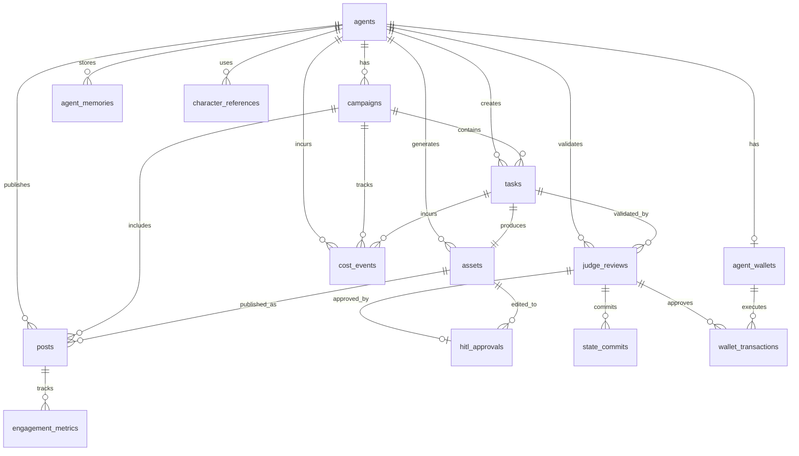

# Project Chimera — Technical Specification

**Date:** 2026-02-04  
**Version:** 1.0  
**Status:** Active

---

## 1. Overview

This document defines API contracts (JSON schemas) and database schema (ERD) for Project Chimera. All APIs use JSON for request/response payloads and are validated using Pydantic models.

---

## 2. API Contracts

### 2.1 Planner API

#### 2.1.1 Decompose Goals

**Endpoint**: `POST /planner/decompose`

**Request Schema**:
```json
{
  "agent_id": "string",
  "goals": [
    {
      "goal_id": "string",
      "description": "string",
      "priority": "high|medium|low",
      "deadline": "ISO8601 datetime (optional)"
    }
  ],
  "context": {
    "state_version": "integer",
    "current_tasks": ["task_id"],
    "episodic_memory_ref": "string (optional, Redis key reference for episodic memory - last 1 hour window)"
  },
  "persona_config": {
    "agent_id": "string",
    "persona_name": "string",
    "policy_version": "string"
  }
}
```

**Response Schema**:
```json
{
  "task_dag": {
    "tasks": [
      {
        "task_id": "string (UUID)",
        "agent_id": "string",
        "task_type": "generate_text|generate_image|render_video|post_content|engage_reply",
        "priority": "high|medium|low",
        "dependencies": ["task_id"],
        "context": {
          "goal_description": "string",
          "persona_constraints": ["string"],
          "required_resources": ["mcp://twitter/mentions/123", "mcp://memory/recent"]
        },
        "parameters": {
          "prompt": "string",
          "platform": "twitter|instagram|tiktok",
          "tier": "tier_1_daily|tier_2_hero (optional, for video generation)",
          "character_reference_id": "string (optional, for image generation)",
          "mcp_tool": "string"
        },
        "assigned_worker_id": "string (optional)",
        "created_at": "ISO8601 datetime"
      }
    ],
    "edges": [
      {
        "from_task_id": "string",
        "to_task_id": "string"
      }
    ]
  },
  "state_version_snapshot": "integer"
}
```

**Note**: Episodic memory is stored in Redis (high-speed cache) for the last 1 hour window. The `episodic_memory_ref` field is a Redis key reference, not the actual content. Use the Memory Retrieval API (Section 2.1.4) to fetch episodic memory content.

---

#### 2.1.2 Replan Tasks

**Endpoint**: `POST /planner/replan`

**Request Schema**:
```json
{
  "agent_id": "string",
  "current_state_version": "integer",
  "trigger_reason": "state_changed|goal_updated|external_event",
  "active_tasks": ["task_id"],
  "context_updates": {
    "new_goals": ["goal_id"],
    "cancelled_goals": ["goal_id"],
    "external_events": ["event_description"]
  }
}
```

**Response Schema**:
```json
{
  "updated_task_dag": {
    "tasks": ["task object"],
    "edges": ["edge object"]
  },
  "cancelled_tasks": ["task_id"],
  "new_tasks": ["task_id"],
  "state_version_snapshot": "integer"
}
```

---

#### 2.1.3 Semantic Filter & Relevance Scoring

**Endpoint**: `POST /planner/semantic-filter`

**Request Schema**:
```json
{
  "agent_id": "string",
  "content": {
    "type": "text|image|video",
    "content": "string",
    "source": "string (e.g., mcp://twitter/mentions/123)"
  },
  "context": {
    "active_goals": ["goal_id"],
    "relevance_threshold": "float (default: 0.75)"
  }
}
```

**Response Schema**:
```json
{
  "filtered": "boolean",
  "relevance_score": "float (0.0 to 1.0)",
  "relevance_threshold": "float",
  "reasoning": "string",
  "should_create_task": "boolean"
}
```

---

#### 2.1.4 Hierarchical Memory Retrieval

**Endpoint**: `POST /memory/retrieve`

**Request Schema**:
```json
{
  "agent_id": "string",
  "query": "string",
  "memory_types": ["episodic|semantic"],
  "limit": "integer (default: 5 for semantic, 10 for episodic)"
}
```

**Response Schema**:
```json
{
  "memories": [
    {
      "memory_id": "string (UUID)",
      "memory_type": "episodic|semantic",
      "content": "string",
      "relevance_score": "float (0.0 to 1.0)",
      "created_at": "ISO8601 datetime",
      "accessed_at": "ISO8601 datetime"
    }
  ],
  "episodic_count": "integer",
  "semantic_count": "integer"
}
```

---

#### 2.1.5 Store Memory (Dynamic Persona Evolution)

**Endpoint**: `POST /memory/store`

**Request Schema**:
```json
{
  "agent_id": "string",
  "memory_type": "semantic",
  "content": "string",
  "metadata": {
    "interaction_summary": "string",
    "engagement_metrics": {
      "views": "integer",
      "likes": "integer",
      "engagement_rate": "float"
    },
    "triggered_by": "judge|planner|human"
  }
}
```

**Response Schema**:
```json
{
  "memory_id": "string (UUID)",
  "stored": "boolean",
  "embedding_created": "boolean"
}
```

---

### 2.2 Worker API

#### 2.2.1 Execute Task

**Endpoint**: `POST /worker/execute`

**Request Schema**:
```json
{
  "task_id": "string (UUID)",
  "agent_id": "string",
  "task_type": "generate_text|generate_image|render_video|post_content|engage_reply",
  "priority": "high|medium|low",
  "context": {
    "goal_description": "string",
    "persona_constraints": ["string"],
    "required_resources": ["mcp://twitter/mentions/123", "mcp://memory/recent"]
  },
  "parameters": {
    "prompt": "string",
    "platform": "string (optional)",
    "tier": "tier_1_daily|tier_2_hero (optional, for video generation)",
    "character_reference_id": "string (optional, for image generation)",
    "mcp_tool": "string",
    "context": "object (optional)"
  },
  "state_version_snapshot": "integer"
}
```

**Response Schema**:
```json
{
  "result_id": "string (UUID)",
  "task_id": "string",
  "agent_id": "string",
  "artifact": {
    "type": "text|image|video",
    "content": "string (text content or URL to object storage)",
    "metadata": {
      "dimensions": {"width": "integer", "height": "integer"} (for media),
      "duration": "integer (seconds)" (for video),
      "file_size": "integer (bytes)",
      "mime_type": "string"
    }
  },
  "confidence_score": "float (0.0 to 1.0)",
  "risk_tags": ["string"],
  "disclosure_level": "automated|assisted|none",
  "tool_provenance": {
    "mcp_tool": "string",
    "tool_version": "string",
    "parameters_used": "object",
    "cost_estimate": "float (optional)"
  },
  "execution_metadata": {
    "started_at": "ISO8601 datetime",
    "completed_at": "ISO8601 datetime",
    "duration_ms": "integer"
  }
}
```

---

#### 2.2.2 Check Task Status

**Endpoint**: `GET /worker/task/{task_id}/status`

**Response Schema**:
```json
{
  "task_id": "string",
  "status": "pending|executing|completed|failed|cancelled",
  "result_id": "string (optional, if completed)",
  "error": {
    "code": "string",
    "message": "string",
    "stack_trace": "string (optional)"
  } (optional, if failed)
}
```

---

#### 2.2.3 Detect Trends

**Endpoint**: `POST /worker/detect-trends`

**Request Schema**:
```json
{
  "agent_id": "string",
  "platform": "twitter|instagram|tiktok",
  "query": "string (optional, topic/keyword)",
  "time_window": "1h|24h|7d|30d (default: 24h)"
}
```

**Response Schema**:
```json
{
  "trends": [
    {
      "trend_id": "string",
      "topic": "string",
      "trend_score": "float (0.0 to 1.0)",
      "source": "string",
      "sample_content": "string",
      "detected_at": "ISO8601 datetime"
    }
  ],
  "total_trends": "integer"
}
```

---

### 2.3 Judge API

#### 2.3.1 Validate Result

**Endpoint**: `POST /judge/validate`

**Request Schema**:
```json
{
  "result_id": "string (UUID)",
  "task_id": "string",
  "agent_id": "string",
  "artifact": {
    "type": "text|image|video",
    "content": "string",
    "metadata": "object"
  },
  "confidence_score": "float",
  "risk_tags": ["string"],
  "disclosure_level": "string",
  "tool_provenance": "object",
  "input_state_version": "integer"
}
```

**Response Schema**:
```json
{
  "review_id": "string (UUID)",
  "result_id": "string",
  "validation_result": {
    "quality_score": "float (0.0 to 1.0)",
    "policy_compliant": "boolean",
    "sensitive_topics_detected": ["string"],
    "violations": [
      {
        "rule": "string",
        "severity": "critical|warning|info",
        "message": "string"
      }
    ]
  },
  "routing_decision": {
    "action": "auto_execute|hitl_queue|retry",
    "reason": "string",
    "confidence_tier": "high|medium|low"
  },
  "occ_check": {
    "input_state_version": "integer",
    "current_state_version": "integer",
    "consistent": "boolean"
  }
}
```

---

#### 2.3.2 Commit Result (OCC)

**Endpoint**: `POST /judge/commit`

**Request Schema**:
```json
{
  "review_id": "string (UUID)",
  "result_id": "string",
  "agent_id": "string",
  "task_id": "string",
  "input_state_version": "integer",
  "output_state_version": "integer",
  "commit_hash": "string (SHA-256 of artifact + metadata)",
  "routing_decision": {
    "action": "auto_execute|hitl_queue|retry"
  }
}
```

**Response Schema**:
```json
{
  "commit_id": "string (UUID)",
  "committed": "boolean",
  "new_state_version": "integer",
  "error": {
    "code": "occ_conflict|validation_failed|internal_error",
    "message": "string"
  } (optional, if commit failed)
}
```

---

#### 2.3.3 CFO Judge: Validate Transaction

**Endpoint**: `POST /judge/cfo/validate-transaction`

**Request Schema**:
```json
{
  "transaction_request": {
    "agent_id": "string",
    "campaign_id": "string (optional)",
    "amount": "float",
    "currency": "string",
    "purpose": "string",
    "recipient": "string",
    "on_chain": "boolean"
  },
  "budget_context": {
    "agent_budget_remaining": "float",
    "campaign_budget_remaining": "float (optional)",
    "global_budget_remaining": "float"
  }
}
```

**Response Schema**:
```json
{
  "approval_id": "string (UUID)",
  "approved": "boolean",
  "reason": "string",
  "budget_updates": {
    "agent_budget_remaining": "float",
    "campaign_budget_remaining": "float (optional)",
    "global_budget_remaining": "float"
  }
}
```

---

### 2.4 GlobalState API

#### 2.4.1 Read State

**Endpoint**: `GET /globalstate/{agent_id}`

**Response Schema**:
```json
{
  "agent_id": "string",
  "state_version": "integer",
  "goals": [
    {
      "goal_id": "string",
      "description": "string",
      "status": "active|completed|cancelled",
      "priority": "string"
    }
  ],
  "active_tasks": ["task_id"],
  "campaigns": [
    {
      "campaign_id": "string",
      "name": "string",
      "status": "active|paused|completed",
      "budget_remaining": "float"
    }
  ],
  "persona_config": {
    "agent_id": "string",
    "persona_name": "string",
    "policy_version": "string",
    "last_updated": "ISO8601 datetime"
  }
}
```

---

#### 2.4.2 Update State (OCC)

**Endpoint**: `POST /globalstate/update`

**Request Schema**:
```json
{
  "agent_id": "string",
  "input_state_version": "integer",
  "updates": {
    "goals": [
      {
        "action": "add|update|remove",
        "goal": "goal object"
      }
    ],
    "campaigns": [
      {
        "action": "add|update|remove",
        "campaign": "campaign object"
      }
    ]
  },
  "commit_hash": "string"
}
```

**Response Schema**:
```json
{
  "updated": "boolean",
  "new_state_version": "integer",
  "error": {
    "code": "occ_conflict|validation_failed",
    "message": "string"
  } (optional, if update failed)
}
```

---

### 2.5 Dashboard API

#### 2.5.1 Get HITL Queue

**Endpoint**: `GET /dashboard/hitl-queue`

**Query Parameters**:
- `filter`: `all|sensitive|low_confidence|financial` (default: `all`)
- `limit`: `integer` (default: 50)
- `offset`: `integer` (default: 0)

**Response Schema**:
```json
{
  "items": [
    {
      "review_id": "string (UUID)",
      "result_id": "string",
      "agent_id": "string",
      "artifact": {
        "type": "text|image|video",
        "content": "string",
        "preview_url": "string (for media)"
      },
      "confidence_score": "float",
      "risk_tags": ["string"],
      "judge_reasoning": "string",
      "created_at": "ISO8601 datetime",
      "pending_since": "ISO8601 datetime"
    }
  ],
  "total_count": "integer",
  "has_more": "boolean"
}
```

---

#### 2.5.2 Approve HITL Item

**Endpoint**: `POST /dashboard/hitl-queue/{review_id}/approve`

**Request Schema**:
```json
{
  "reviewer_id": "string",
  "notes": "string (optional)"
}
```

**Response Schema**:
```json
{
  "approval_id": "string (UUID)",
  "approved": "boolean",
  "execution_released": "boolean",
  "new_state_version": "integer"
}
```

---

#### 2.5.3 Reject HITL Item

**Endpoint**: `POST /dashboard/hitl-queue/{review_id}/reject`

**Request Schema**:
```json
{
  "reviewer_id": "string",
  "reason": "string"
}
```

**Response Schema**:
```json
{
  "rejection_id": "string (UUID)",
  "rejected": "boolean",
  "workflow_terminated": "boolean"
}
```

---

#### 2.5.4 Edit HITL Item

**Endpoint**: `POST /dashboard/hitl-queue/{review_id}/edit`

**Request Schema**:
```json
{
  "reviewer_id": "string",
  "edits": {
    "artifact": {
      "type": "text|image|video",
      "content": "string (edited content)"
    },
    "notes": "string (optional)"
  }
}
```

**Response Schema**:
```json
{
  "edit_id": "string (UUID)",
  "edited_artifact_id": "string",
  "requires_revalidation": "boolean",
  "new_review_id": "string (UUID, if revalidation required)"
}
```

---

#### 2.5.5 Get Fleet Status

**Endpoint**: `GET /dashboard/fleet-status`

**Response Schema**:
```json
{
  "fleet_overview": {
    "total_agents": "integer",
    "active_agents": "integer",
    "idle_agents": "integer",
    "error_agents": "integer"
  },
  "queue_depths": {
    "task_queue": "integer",
    "review_queue": "integer",
    "hitl_queue": "integer"
  },
  "error_rates": {
    "last_hour": "float",
    "last_24_hours": "float"
  },
  "recent_errors": [
    {
      "error_id": "string",
      "agent_id": "string",
      "error_type": "string",
      "message": "string",
      "timestamp": "ISO8601 datetime"
    }
  ]
}
```

---

#### 2.5.6 Get Cost Metrics

**Endpoint**: `GET /dashboard/cost-metrics`

**Query Parameters**:
- `agent_id`: `string (optional)`
- `campaign_id`: `string (optional)`
- `start_date`: `ISO8601 date`
- `end_date`: `ISO8601 date`

**Response Schema**:
```json
{
  "total_cost": "float",
  "cost_by_category": {
    "inference": "float",
    "generation": "float",
    "posting": "float",
    "transactions": "float"
  },
  "cost_by_agent": [
    {
      "agent_id": "string",
      "total_cost": "float",
      "cost_per_engagement": "float"
    }
  ],
  "cost_trends": [
    {
      "date": "ISO8601 date",
      "total_cost": "float"
    }
  ],
  "budget_status": {
    "global_budget_remaining": "float",
    "global_budget_limit": "float",
    "percentage_used": "float"
  }
}
```

---

### 2.6 Wallet Management API (Coinbase AgentKit)

#### 2.6.1 Get Wallet Balance

**Endpoint**: `GET /wallet/{agent_id}/balance`

**Response Schema**:
```json
{
  "agent_id": "string",
  "wallet_address": "string",
  "network": "base|ethereum|solana",
  "balances": [
    {
      "currency": "ETH|USDC|SOL",
      "amount": "float",
      "usd_value": "float (optional)"
    }
  ],
  "last_updated": "ISO8601 datetime"
}
```

---

#### 2.6.2 Transfer Assets

**Endpoint**: `POST /wallet/{agent_id}/transfer`

**Request Schema**:
```json
{
  "to_address": "string",
  "amount": "float",
  "currency": "ETH|USDC",
  "network": "base|ethereum",
  "purpose": "string (optional)",
  "requires_cfo_approval": "boolean (default: true)"
}
```

**Response Schema**:
```json
{
  "transaction_id": "string (UUID)",
  "transaction_hash": "string (on-chain transaction hash)",
  "status": "pending|confirmed|failed",
  "from_address": "string",
  "to_address": "string",
  "amount": "float",
  "currency": "string",
  "network": "string",
  "cfo_approval_id": "string (UUID, if required)",
  "created_at": "ISO8601 datetime"
}
```

---

#### 2.6.3 Deploy Token

**Endpoint**: `POST /wallet/{agent_id}/deploy-token`

**Request Schema**:
```json
{
  "token_name": "string",
  "token_symbol": "string",
  "total_supply": "integer",
  "network": "base|ethereum",
  "requires_cfo_approval": "boolean (default: true)"
}
```

**Response Schema**:
```json
{
  "transaction_id": "string (UUID)",
  "token_address": "string",
  "transaction_hash": "string",
  "status": "pending|confirmed|failed",
  "created_at": "ISO8601 datetime"
}
```

---

### 2.7 MCP Resource API

#### 2.7.1 List Available Resources

**Endpoint**: `GET /mcp/resources/{agent_id}`

**Response Schema**:
```json
{
  "agent_id": "string",
  "resources": [
    {
      "resource_uri": "string (e.g., mcp://twitter/mentions/123)",
      "resource_type": "mentions|memory|trends",
      "mcp_server": "string",
      "available": "boolean",
      "last_updated": "ISO8601 datetime"
    }
  ]
}
```

---

#### 2.7.2 Fetch Resource

**Endpoint**: `GET /mcp/resources/{agent_id}/{resource_uri}`

**Query Parameters**:
- `resource_uri`: URL-encoded resource URI (e.g., `mcp%3A%2F%2Ftwitter%2Fmentions%2F123`)

**Response Schema**:
```json
{
  "resource_uri": "string",
  "resource_type": "string",
  "content": "object",
  "mcp_server": "string",
  "fetched_at": "ISO8601 datetime"
}
```

---

### 2.8 Campaign Composer API

#### 2.8.1 Compose Campaign from Natural Language

**Endpoint**: `POST /campaign/compose`

**Request Schema**:
```json
{
  "agent_id": "string",
  "natural_language_goal": "string",
  "target_audience": "string (optional)",
  "budget_constraints": {
    "max_daily_spend": "float (optional)",
    "max_total_spend": "float (optional)"
  },
  "deadline": "ISO8601 datetime (optional)"
}
```

**Response Schema**:
```json
{
  "campaign_id": "string",
  "task_dag": {
    "tasks": ["task object"],
    "edges": ["edge object"]
  },
  "estimated_cost": "float",
  "estimated_duration": "integer (seconds)",
  "requires_approval": "boolean"
}
```

---

#### 2.8.2 Get Campaign Task Tree

**Endpoint**: `GET /campaign/{campaign_id}/task-tree`

**Response Schema**:
```json
{
  "campaign_id": "string",
  "task_tree": {
    "root_tasks": ["task_id"],
    "tasks": ["task object"],
    "edges": ["edge object"],
    "visualization": "string (optional, Mermaid diagram)"
  }
}
```

---

## 3. Database Schema (ERD)

### 3.1 Core Tables

**Note**: OpenClaw-specific tables (`openclaw_status_updates`, `openclaw_capabilities`) are defined in [`specs/openclaw_integration.md` Section 10](openclaw_integration.md#10-database-schema-extensions). These tables should be integrated into the main database schema during implementation.

---

### 3.1 Core Tables

#### 3.1.1 `agents`

Primary entity representing an influencer agent.

```sql
CREATE TABLE agents (
    agent_id VARCHAR(255) PRIMARY KEY,
    persona_name VARCHAR(255) NOT NULL,
    policy_version VARCHAR(50) NOT NULL,
    state_version INTEGER NOT NULL DEFAULT 0,
    status VARCHAR(50) NOT NULL DEFAULT 'active', -- active, paused, deleted
    wallet_address VARCHAR(255), -- Primary wallet address (for agentic commerce)
    wallet_network VARCHAR(50), -- base, ethereum, solana
    created_at TIMESTAMP WITH TIME ZONE NOT NULL DEFAULT NOW(),
    updated_at TIMESTAMP WITH TIME ZONE NOT NULL DEFAULT NOW(),
    persona_config JSONB NOT NULL, -- Full persona configuration from AGENTS.md/SOUL.md
    INDEX idx_agents_status (status),
    INDEX idx_agents_state_version (state_version),
    INDEX idx_agents_wallet (wallet_address)
);
```

---

#### 3.1.2 `campaigns`

Campaigns represent high-level goals or content series for agents.

```sql
CREATE TABLE campaigns (
    campaign_id VARCHAR(255) PRIMARY KEY,
    agent_id VARCHAR(255) NOT NULL REFERENCES agents(agent_id) ON DELETE CASCADE,
    name VARCHAR(255) NOT NULL,
    description TEXT,
    status VARCHAR(50) NOT NULL DEFAULT 'active', -- active, paused, completed
    budget_limit DECIMAL(10, 2),
    budget_remaining DECIMAL(10, 2),
    created_at TIMESTAMP WITH TIME ZONE NOT NULL DEFAULT NOW(),
    updated_at TIMESTAMP WITH TIME ZONE NOT NULL DEFAULT NOW(),
    INDEX idx_campaigns_agent (agent_id),
    INDEX idx_campaigns_status (status)
);
```

---

#### 3.1.3 `tasks`

Atomic tasks created by Planner and executed by Workers.

```sql
CREATE TABLE tasks (
    task_id UUID PRIMARY KEY DEFAULT gen_random_uuid(),
    agent_id VARCHAR(255) NOT NULL REFERENCES agents(agent_id) ON DELETE CASCADE,
    campaign_id VARCHAR(255) REFERENCES campaigns(campaign_id) ON DELETE SET NULL,
    task_type VARCHAR(50) NOT NULL, -- generate_text, generate_image, render_video, post_content, engage_reply
    priority VARCHAR(50) NOT NULL DEFAULT 'medium', -- high, medium, low
    status VARCHAR(50) NOT NULL DEFAULT 'pending', -- pending, executing, completed, failed, cancelled
    parameters JSONB NOT NULL, -- Task parameters (prompt, platform, tier, mcp_tool, character_reference_id, etc.)
    context JSONB, -- goal_description, persona_constraints, required_resources
    dependencies TEXT[], -- Array of task_id UUIDs
    assigned_worker_id VARCHAR(255), -- Optional worker assignment
    state_version_snapshot INTEGER NOT NULL, -- State version when task was created
    created_at TIMESTAMP WITH TIME ZONE NOT NULL DEFAULT NOW(),
    started_at TIMESTAMP WITH TIME ZONE,
    completed_at TIMESTAMP WITH TIME ZONE,
    error JSONB, -- Error details if status = failed
    INDEX idx_tasks_agent (agent_id),
    INDEX idx_tasks_status (status),
    INDEX idx_tasks_campaign (campaign_id),
    INDEX idx_tasks_priority (priority),
    INDEX idx_tasks_created (created_at)
);
```

---

#### 3.1.4 `assets`

Assets represent generated content (text, images, videos) with full lineage.

```sql
CREATE TABLE assets (
    asset_id UUID PRIMARY KEY DEFAULT gen_random_uuid(),
    task_id UUID NOT NULL REFERENCES tasks(task_id) ON DELETE CASCADE,
    agent_id VARCHAR(255) NOT NULL REFERENCES agents(agent_id) ON DELETE CASCADE,
    asset_type VARCHAR(50) NOT NULL, -- text, image, video
    content_hash VARCHAR(64) NOT NULL, -- SHA-256 hash of content
    object_storage_url TEXT, -- URL to S3/GCS for media blobs
    metadata JSONB NOT NULL, -- dimensions, duration, file_size, mime_type, etc.
    lineage JSONB NOT NULL, -- Parent assets, prompt history, edit chain
    tool_provenance JSONB NOT NULL, -- mcp_tool, tool_version, parameters_used, cost_estimate
    created_at TIMESTAMP WITH TIME ZONE NOT NULL DEFAULT NOW(),
    INDEX idx_assets_task (task_id),
    INDEX idx_assets_agent (agent_id),
    INDEX idx_assets_type (asset_type),
    INDEX idx_assets_content_hash (content_hash)
);
```

---

#### 3.1.5 `posts`

Posts represent published content on social platforms.

```sql
CREATE TABLE posts (
    post_id UUID PRIMARY KEY DEFAULT gen_random_uuid(),
    asset_id UUID NOT NULL REFERENCES assets(asset_id) ON DELETE CASCADE,
    agent_id VARCHAR(255) NOT NULL REFERENCES agents(agent_id) ON DELETE CASCADE,
    campaign_id VARCHAR(255) REFERENCES campaigns(campaign_id) ON DELETE SET NULL,
    platform VARCHAR(50) NOT NULL, -- twitter, instagram, tiktok
    platform_post_id VARCHAR(255), -- External platform post ID
    platform_url TEXT, -- URL to post on platform
    status VARCHAR(50) NOT NULL DEFAULT 'scheduled', -- scheduled, published, failed, deleted
    scheduled_at TIMESTAMP WITH TIME ZONE,
    published_at TIMESTAMP WITH TIME ZONE,
    disclosure_level VARCHAR(50) NOT NULL, -- automated, assisted, none
    created_at TIMESTAMP WITH TIME ZONE NOT NULL DEFAULT NOW(),
    INDEX idx_posts_agent (agent_id),
    INDEX idx_posts_platform (platform),
    INDEX idx_posts_status (status),
    INDEX idx_posts_published (published_at),
    UNIQUE (platform, platform_post_id) -- Prevent duplicate platform posts
);
```

---

#### 3.1.6 `judge_reviews`

Judge validation results and routing decisions.

```sql
CREATE TABLE judge_reviews (
    review_id UUID PRIMARY KEY DEFAULT gen_random_uuid(),
    result_id UUID NOT NULL, -- References Worker result (may be in separate results table or JSONB)
    task_id UUID NOT NULL REFERENCES tasks(task_id) ON DELETE CASCADE,
    agent_id VARCHAR(255) NOT NULL REFERENCES agents(agent_id) ON DELETE CASCADE,
    validation_result JSONB NOT NULL, -- quality_score, policy_compliant, sensitive_topics_detected, violations
    routing_decision JSONB NOT NULL, -- action (auto_execute|hitl_queue|retry), reason, confidence_tier
    occ_check JSONB NOT NULL, -- input_state_version, current_state_version, consistent
    judge_type VARCHAR(50) NOT NULL DEFAULT 'content', -- content, cfo
    reasoning_trace TEXT, -- Judge's reasoning (may be redacted for sensitive content)
    created_at TIMESTAMP WITH TIME ZONE NOT NULL DEFAULT NOW(),
    INDEX idx_judge_reviews_task (task_id),
    INDEX idx_judge_reviews_agent (agent_id),
    INDEX idx_judge_reviews_routing (routing_decision->>'action'),
    INDEX idx_judge_reviews_created (created_at)
);
```

---

#### 3.1.7 `hitl_approvals`

Human-in-the-loop approval decisions.

```sql
CREATE TABLE hitl_approvals (
    approval_id UUID PRIMARY KEY DEFAULT gen_random_uuid(),
    review_id UUID NOT NULL REFERENCES judge_reviews(review_id) ON DELETE CASCADE,
    reviewer_id VARCHAR(255) NOT NULL, -- Human moderator user ID
    decision VARCHAR(50) NOT NULL, -- approved, rejected, edited
    artifact_hash VARCHAR(64) NOT NULL, -- SHA-256 of artifact at time of approval
    policy_version VARCHAR(50) NOT NULL, -- Policy version used for validation
    notes TEXT, -- Optional notes from reviewer
    edited_artifact_id UUID REFERENCES assets(asset_id) ON DELETE SET NULL, -- If decision = edited
    created_at TIMESTAMP WITH TIME ZONE NOT NULL DEFAULT NOW(),
    INDEX idx_hitl_approvals_review (review_id),
    INDEX idx_hitl_approvals_reviewer (reviewer_id),
    INDEX idx_hitl_approvals_decision (decision),
    INDEX idx_hitl_approvals_created (created_at)
);
```

---

#### 3.1.8 `engagement_metrics`

Performance analytics for published posts.

```sql
CREATE TABLE engagement_metrics (
    metric_id UUID PRIMARY KEY DEFAULT gen_random_uuid(),
    post_id UUID NOT NULL REFERENCES posts(post_id) ON DELETE CASCADE,
    agent_id VARCHAR(255) NOT NULL REFERENCES agents(agent_id) ON DELETE CASCADE,
    platform VARCHAR(50) NOT NULL,
    views INTEGER DEFAULT 0,
    likes INTEGER DEFAULT 0,
    comments INTEGER DEFAULT 0,
    shares INTEGER DEFAULT 0,
    engagement_delta INTEGER DEFAULT 0, -- Change since last measurement
    measured_at TIMESTAMP WITH TIME ZONE NOT NULL DEFAULT NOW(),
    INDEX idx_engagement_metrics_post (post_id),
    INDEX idx_engagement_metrics_agent (agent_id),
    INDEX idx_engagement_metrics_measured (measured_at)
) PARTITION BY RANGE (measured_at); -- Partition by time for high-velocity data

-- Create monthly partitions (example)
CREATE TABLE engagement_metrics_2026_02 PARTITION OF engagement_metrics
    FOR VALUES FROM ('2026-02-01') TO ('2026-03-01');
```

---

#### 3.1.9 `cost_events`

Cost tracking for all cost-incurring operations.

```sql
CREATE TABLE cost_events (
    event_id UUID PRIMARY KEY DEFAULT gen_random_uuid(),
    agent_id VARCHAR(255) NOT NULL REFERENCES agents(agent_id) ON DELETE CASCADE,
    campaign_id VARCHAR(255) REFERENCES campaigns(campaign_id) ON DELETE SET NULL,
    task_id UUID REFERENCES tasks(task_id) ON DELETE SET NULL,
    cost_category VARCHAR(50) NOT NULL, -- inference, generation, posting, transactions
    tool_name VARCHAR(255), -- MCP tool that incurred cost
    tier VARCHAR(50), -- Generation tier (e.g., "standard", "premium")
    cost_amount DECIMAL(10, 4) NOT NULL,
    currency VARCHAR(10) NOT NULL DEFAULT 'USD',
    cost_estimate DECIMAL(10, 4), -- Estimated cost before execution
    actual_cost DECIMAL(10, 4), -- Actual cost after execution
    metadata JSONB, -- Additional cost context
    created_at TIMESTAMP WITH TIME ZONE NOT NULL DEFAULT NOW(),
    INDEX idx_cost_events_agent (agent_id),
    INDEX idx_cost_events_campaign (campaign_id),
    INDEX idx_cost_events_category (cost_category),
    INDEX idx_cost_events_created (created_at)
) PARTITION BY RANGE (created_at); -- Partition by time for high-velocity data

-- Create monthly partitions (example)
CREATE TABLE cost_events_2026_02 PARTITION OF cost_events
    FOR VALUES FROM ('2026-02-01') TO ('2026-03-01');
```

---

#### 3.1.10 `state_commits`

OCC commit log for audit and debugging.

```sql
CREATE TABLE state_commits (
    commit_id UUID PRIMARY KEY DEFAULT gen_random_uuid(),
    agent_id VARCHAR(255) NOT NULL REFERENCES agents(agent_id) ON DELETE CASCADE,
    task_id UUID REFERENCES tasks(task_id) ON DELETE SET NULL,
    input_state_version INTEGER NOT NULL,
    output_state_version INTEGER NOT NULL,
    commit_hash VARCHAR(64) NOT NULL, -- SHA-256 of artifact + metadata
    committed_by VARCHAR(50) NOT NULL, -- judge, human_moderator, system
    committed_at TIMESTAMP WITH TIME ZONE NOT NULL DEFAULT NOW(),
    occ_conflict BOOLEAN DEFAULT FALSE, -- True if commit was rejected due to OCC conflict
    INDEX idx_state_commits_agent (agent_id),
    INDEX idx_state_commits_state_version (output_state_version),
    INDEX idx_state_commits_committed (committed_at)
);
```

---

#### 3.1.11 `character_references`

Character consistency lock for image generation (FR 3.1).

```sql
CREATE TABLE character_references (
    character_reference_id UUID PRIMARY KEY DEFAULT gen_random_uuid(),
    agent_id VARCHAR(255) NOT NULL REFERENCES agents(agent_id) ON DELETE CASCADE,
    lora_id VARCHAR(255), -- LoRA identifier for style consistency
    style_config JSONB NOT NULL, -- Canonical facial features, style settings
    canonical_features JSONB, -- Reference images, feature descriptors
    created_at TIMESTAMP WITH TIME ZONE NOT NULL DEFAULT NOW(),
    updated_at TIMESTAMP WITH TIME ZONE NOT NULL DEFAULT NOW(),
    INDEX idx_character_references_agent (agent_id),
    UNIQUE (agent_id, lora_id)
);
```

---

#### 3.1.12 `agent_wallets`

Non-custodial wallet management (FR 5.0).

```sql
CREATE TABLE agent_wallets (
    wallet_id UUID PRIMARY KEY DEFAULT gen_random_uuid(),
    agent_id VARCHAR(255) NOT NULL REFERENCES agents(agent_id) ON DELETE CASCADE,
    wallet_address VARCHAR(255) NOT NULL,
    network VARCHAR(50) NOT NULL, -- base, ethereum, solana
    encrypted_key_ref VARCHAR(255) NOT NULL, -- Reference to encrypted key in secrets manager
    balance_snapshot JSONB, -- Last known balances (ETH, USDC, etc.)
    last_balance_check TIMESTAMP WITH TIME ZONE,
    created_at TIMESTAMP WITH TIME ZONE NOT NULL DEFAULT NOW(),
    updated_at TIMESTAMP WITH TIME ZONE NOT NULL DEFAULT NOW(),
    INDEX idx_agent_wallets_agent (agent_id),
    INDEX idx_agent_wallets_address (wallet_address),
    UNIQUE (agent_id, network)
);
```

---

#### 3.1.13 `wallet_transactions`

On-chain transaction history (FR 5.1).

```sql
CREATE TABLE wallet_transactions (
    transaction_id UUID PRIMARY KEY DEFAULT gen_random_uuid(),
    agent_id VARCHAR(255) NOT NULL REFERENCES agents(agent_id) ON DELETE CASCADE,
    wallet_id UUID NOT NULL REFERENCES agent_wallets(wallet_id) ON DELETE CASCADE,
    transaction_hash VARCHAR(255) NOT NULL UNIQUE, -- On-chain transaction hash
    transaction_type VARCHAR(50) NOT NULL, -- native_transfer, deploy_token, erc20_transfer
    from_address VARCHAR(255) NOT NULL,
    to_address VARCHAR(255),
    amount DECIMAL(20, 8) NOT NULL,
    currency VARCHAR(10) NOT NULL, -- ETH, USDC, SOL
    network VARCHAR(50) NOT NULL,
    status VARCHAR(50) NOT NULL DEFAULT 'pending', -- pending, confirmed, failed
    cfo_approval_id UUID REFERENCES judge_reviews(review_id) ON DELETE SET NULL,
    purpose TEXT,
    block_number INTEGER,
    confirmed_at TIMESTAMP WITH TIME ZONE,
    created_at TIMESTAMP WITH TIME ZONE NOT NULL DEFAULT NOW(),
    INDEX idx_wallet_transactions_agent (agent_id),
    INDEX idx_wallet_transactions_hash (transaction_hash),
    INDEX idx_wallet_transactions_status (status),
    INDEX idx_wallet_transactions_created (created_at)
);
```

---

#### 3.1.14 `agent_memories`

Hierarchical memory storage (FR 1.1, 1.2).

```sql
CREATE TABLE agent_memories (
    memory_id UUID PRIMARY KEY DEFAULT gen_random_uuid(),
    agent_id VARCHAR(255) NOT NULL REFERENCES agents(agent_id) ON DELETE CASCADE,
    memory_type VARCHAR(50) NOT NULL, -- episodic, semantic
    content TEXT NOT NULL,
    embedding_vector VECTOR(1536), -- Weaviate embedding (if semantic)
    relevance_tags TEXT[], -- Tags for semantic search
    created_at TIMESTAMP WITH TIME ZONE NOT NULL DEFAULT NOW(),
    accessed_at TIMESTAMP WITH TIME ZONE,
    access_count INTEGER DEFAULT 0,
    metadata JSONB, -- interaction_summary, engagement_metrics, triggered_by
    INDEX idx_agent_memories_agent (agent_id),
    INDEX idx_agent_memories_type (memory_type),
    INDEX idx_agent_memories_created (created_at)
);

-- Note: Episodic memories are primarily stored in Redis (last 1 hour window).
-- This table stores semantic memories in Weaviate and long-term episodic summaries.
```

---

#### 3.1.15 `memory_retrievals`

Audit log for memory retrieval operations.

```sql
CREATE TABLE memory_retrievals (
    retrieval_id UUID PRIMARY KEY DEFAULT gen_random_uuid(),
    agent_id VARCHAR(255) NOT NULL REFERENCES agents(agent_id) ON DELETE CASCADE,
    query TEXT NOT NULL,
    memory_type VARCHAR(50) NOT NULL, -- episodic, semantic, both
    memories_retrieved TEXT[], -- Array of memory_id UUIDs
    relevance_scores JSONB, -- Map of memory_id to relevance_score
    created_at TIMESTAMP WITH TIME ZONE NOT NULL DEFAULT NOW(),
    INDEX idx_memory_retrievals_agent (agent_id),
    INDEX idx_memory_retrievals_created (created_at)
);
```

---

### 3.2 Relationships (ERD)



---

### 3.3 Indexing Strategy

#### 3.3.1 Composite Indexes

- `(agent_id, created_at)` on `tasks`, `assets`, `posts` for agent timeline queries
- `(agent_id, status)` on `tasks` for active task lookups
- `(platform, status)` on `posts` for platform-specific queries

#### 3.3.2 Partial Indexes

- `status IN ('pending', 'review', 'failed')` on `tasks` for queue processing
- `routing_decision->>'action' = 'hitl_queue'` on `judge_reviews` for HITL queue queries

#### 3.3.3 JSONB Indexes

- GIN indexes on `persona_config`, `parameters`, `metadata`, `lineage` for JSONB queries
- `(routing_decision jsonb_path_ops)` on `judge_reviews` for routing decision queries

---

### 3.4 Partitioning Strategy

**Time-based partitioning** for high-velocity tables:

- `engagement_metrics`: Partitioned by `measured_at` (monthly partitions)
- `cost_events`: Partitioned by `created_at` (monthly partitions)

**Benefits**:
- Faster queries on recent data (only scan relevant partitions)
- Easier archival of old data (drop old partitions)
- Better maintenance (vacuum, analyze on smaller partitions)

---

### 3.5 Data Retention

- **Active data**: Keep all data for 90 days
- **Archival**: Move data older than 90 days to cold storage (S3/GCS)
- **Audit logs**: Keep indefinitely (immutable)

---

### 3.6 Database Choice & Architecture

**Primary Database: PostgreSQL 15+**

PostgreSQL is selected as the primary database for Project Chimera due to:

- **ACID compliance**: Required for OCC (Optimistic Concurrency Control) and transactional integrity
- **JSONB support**: Flexible schema for task parameters, metadata, lineage, and persona configs
- **Partitioning**: Native support for time-based partitioning of high-velocity tables
- **Full-text search**: Built-in support for semantic search and content indexing
- **Extensibility**: Support for vector extensions (pgvector) for future semantic memory integration
- **Mature ecosystem**: Proven at scale for enterprise applications

**Secondary Data Stores:**

- **Redis**: Episodic memory cache (last 1 hour window), task queues, rate limiting
- **Weaviate**: Semantic memory storage (vector database for long-term agent memories)
- **Object Storage (S3/GCS)**: Media blobs (images, videos) with CDN distribution
- **On-chain Ledger (Base/Ethereum)**: Immutable transaction history

---

### 3.7 Data Lifecycle Management

#### 3.7.1 Data Ingestion

**Pattern**: Event-driven ingestion with queue-based processing

1. **Task Creation** (Planner → Database):
   - Planner creates tasks via `POST /planner/decompose`
   - Tasks inserted into `tasks` table with `state_version_snapshot`
   - Tasks enqueued to Redis `task_queue` for Worker consumption

2. **Worker Results** (Worker → Database):
   - Workers execute tasks and push results to `review_queue` (Redis)
   - Judge consumes from `review_queue` and validates
   - Validated results committed to `assets` table via `POST /judge/commit` (OCC)

3. **Post Publication** (Worker → Database):
   - Published posts inserted into `posts` table
   - Engagement metrics ingested via platform APIs (periodic polling or webhooks)
   - Metrics inserted into `engagement_metrics` (partitioned table)

4. **Cost Events** (Worker → Database):
   - Cost events logged immediately after MCP tool execution
   - Inserted into `cost_events` (partitioned table) with atomic Redis budget updates

5. **Memory Storage** (Judge → Weaviate):
   - Semantic memories stored via `POST /memory/store`
   - Episodic memories cached in Redis (TTL: 1 hour)
   - Long-term episodic summaries written to `agent_memories` table

**Ingestion Rate Handling:**
- **High-velocity tables** (`engagement_metrics`, `cost_events`): Use partitioned tables with monthly partitions
- **Bulk inserts**: Use `COPY` command for batch ingestion of engagement metrics
- **Queue buffering**: Redis queues prevent database overload during spikes

---

#### 3.7.2 Data Transformation

**ETL Patterns:**

1. **Task DAG Transformation**:
   - Planner decomposes goals into task DAG
   - DAG stored as JSONB in `tasks` table with dependency edges
   - Workers consume tasks and transform into artifacts

2. **Asset Lineage Transformation**:
   - Worker results transformed into `assets` with full lineage (parent assets, prompt history, edit chain)
   - Lineage stored as JSONB for query flexibility

3. **Engagement Metrics Aggregation**:
   - Raw metrics from platforms aggregated into `engagement_metrics`
   - Delta calculations (`engagement_delta`) computed during ingestion
   - Real-time aggregation via materialized views for dashboard queries

4. **Memory Embedding Transformation**:
   - Semantic memories transformed into vector embeddings (1536 dimensions) via Weaviate
   - Embeddings stored in `agent_memories.embedding_vector` for similarity search

5. **Cost Aggregation**:
   - Individual cost events aggregated by agent, campaign, category
   - Real-time budget calculations via Redis counters
   - Historical cost trends computed via materialized views

---

#### 3.7.3 Data Storage Strategy

**Storage Tiers:**

1. **Hot Storage (PostgreSQL)**:
   - Active data (last 90 days)
   - All transactional data (tasks, assets, posts, reviews)
   - Current agent state, campaigns, wallets

2. **Warm Storage (PostgreSQL Partitions)**:
   - Partitioned tables for high-velocity data
   - Monthly partitions for `engagement_metrics` and `cost_events`
   - Partitions older than 90 days marked for archival

3. **Cold Storage (S3/GCS)**:
   - Archived data (older than 90 days)
   - Media blobs (images, videos) with lifecycle policies
   - Immutable audit logs (compressed and archived)

4. **Cache Layer (Redis)**:
   - Episodic memory (TTL: 1 hour)
   - Task queues (`task_queue`, `review_queue`, `hitl_queue`)
   - Budget counters (`daily_spend`, `campaign_budget_remaining`)

5. **Vector Storage (Weaviate)**:
   - Semantic memories with embeddings
   - Persona definitions and world knowledge
   - Long-term agent biography

**Storage Optimization:**
- **JSONB compression**: PostgreSQL automatically compresses JSONB columns
- **Partition pruning**: Queries automatically exclude irrelevant partitions
- **Index-only scans**: Composite indexes enable index-only queries for common patterns
- **TOAST storage**: Large JSONB values stored out-of-line automatically

---

#### 3.7.4 Data Retrieval Patterns

**Query Patterns:**

1. **Agent Timeline Queries**:
   - Composite index `(agent_id, created_at)` on `tasks`, `assets`, `posts`
   - Efficient range queries for agent activity over time

2. **HITL Queue Queries**:
   - Partial index on `judge_reviews` where `routing_decision->>'action' = 'hitl_queue'`
   - Filtered queries for pending human review items

3. **Semantic Memory Retrieval**:
   - Vector similarity search via Weaviate
   - Relevance scoring and top-K retrieval
   - Episodic memory retrieval from Redis (fast lookup)

4. **Analytics Queries**:
   - Materialized views for cost aggregation by agent/campaign
   - Partition pruning for time-range queries on `engagement_metrics`
   - JSONB path queries for filtering by metadata

5. **Fleet Status Queries**:
   - Real-time queue depths from Redis
   - Agent status aggregation from `agents` table
   - Error rate calculations from recent `tasks` with error status

**Retrieval Optimization:**
- **Read replicas**: PostgreSQL read replicas for analytics queries (separate from primary)
- **Connection pooling**: PgBouncer for connection management
- **Query result caching**: Redis cache for frequently accessed data (agent configs, campaign details)
- **Lazy loading**: Large JSONB fields (lineage, metadata) loaded on-demand

---

#### 3.7.5 Migration Strategy

**Database Migrations:**

1. **Schema Versioning**:
   - Use Alembic (Python) or Flyway (Java) for migration management
   - Version-controlled migration scripts in `migrations/` directory
   - Forward-only migrations (no rollbacks for production data)

2. **Zero-Downtime Migrations**:
   - **Additive changes**: New columns/tables added without locking
   - **Column additions**: Use `ALTER TABLE ... ADD COLUMN ... DEFAULT ...` (PostgreSQL 11+)
   - **Index creation**: Use `CREATE INDEX CONCURRENTLY` for large tables
   - **Partition management**: Add new partitions without downtime

3. **Data Migrations**:
   - **Backfill scripts**: Run in batches during low-traffic periods
   - **Dual-write pattern**: Write to both old and new schemas during transition
   - **Validation**: Compare old vs. new data before cutover

4. **Partition Management**:
   - **Monthly partition creation**: Automated via cron job (creates next month's partition)
   - **Partition archival**: Automated script moves old partitions to cold storage
   - **Partition cleanup**: Drop archived partitions after S3 backup verification

5. **Rollback Strategy**:
   - **Feature flags**: Use feature flags to disable new functionality if issues arise
   - **Database backups**: Continuous WAL archiving for point-in-time recovery
   - **Schema rollback**: Only for non-data-affecting changes (index drops, constraint removals)

**Example Migration Script Structure:**
```sql
-- migrations/001_initial_schema.sql
-- migrations/002_add_wallet_tables.sql
-- migrations/003_add_memory_tables.sql
-- migrations/004_partition_engagement_metrics.sql
-- migrations/005_add_character_references.sql
```

---

## 4. Pydantic Models (Python)

### 4.1 Task Model

```python
from pydantic import BaseModel, Field
from typing import List, Optional
from datetime import datetime
from uuid import UUID

class Task(BaseModel):
    task_id: UUID
    agent_id: str
    campaign_id: Optional[str] = None
    task_type: str = Field(..., pattern="^(generate_text|generate_image|render_video|post_content|engage_reply)$")
    priority: str = Field(default="medium", pattern="^(high|medium|low)$")
    status: str = Field(default="pending", pattern="^(pending|executing|completed|failed|cancelled)$")
    parameters: dict
    context: Optional[dict] = None  # goal_description, persona_constraints, required_resources
    dependencies: List[UUID] = []
    assigned_worker_id: Optional[str] = None
    state_version_snapshot: int
    created_at: datetime
    started_at: Optional[datetime] = None
    completed_at: Optional[datetime] = None
    error: Optional[dict] = None
```

---

### 4.2 Worker Result Model

```python
class WorkerResult(BaseModel):
    result_id: UUID
    task_id: UUID
    agent_id: str
    artifact: dict  # {type, content, metadata}
    confidence_score: float = Field(..., ge=0.0, le=1.0)
    risk_tags: List[str] = []
    disclosure_level: str = Field(..., pattern="^(automated|assisted|none)$")
    tool_provenance: dict
    execution_metadata: dict
```

---

### 4.3 Judge Review Model

```python
class JudgeReview(BaseModel):
    review_id: UUID
    result_id: UUID
    task_id: UUID
    agent_id: str
    validation_result: dict  # {quality_score, policy_compliant, sensitive_topics_detected, violations}
    routing_decision: dict  # {action, reason, confidence_tier}
    occ_check: dict  # {input_state_version, current_state_version, consistent}
    judge_type: str = Field(default="content", pattern="^(content|cfo)$")
    reasoning_trace: Optional[str] = None
    created_at: datetime
```

---

### 4.4 Wallet Transaction Model

```python
class WalletTransaction(BaseModel):
    transaction_id: UUID
    agent_id: str
    wallet_id: UUID
    transaction_hash: str
    transaction_type: str = Field(..., pattern="^(native_transfer|deploy_token|erc20_transfer)$")
    from_address: str
    to_address: Optional[str] = None
    amount: float
    currency: str
    network: str
    status: str = Field(..., pattern="^(pending|confirmed|failed)$")
    cfo_approval_id: Optional[UUID] = None
    created_at: datetime
```

---

### 4.5 Memory Model

```python
class AgentMemory(BaseModel):
    memory_id: UUID
    agent_id: str
    memory_type: str = Field(..., pattern="^(episodic|semantic)$")
    content: str
    relevance_tags: List[str] = []
    created_at: datetime
    accessed_at: Optional[datetime] = None
    metadata: Optional[dict] = None
```

---

### 4.6 Character Reference Model

```python
class CharacterReference(BaseModel):
    character_reference_id: UUID
    agent_id: str
    lora_id: Optional[str] = None
    style_config: dict
    canonical_features: Optional[dict] = None
    created_at: datetime
    updated_at: datetime
```

---

## 5. API Error Responses

All APIs return errors in this format:

```json
{
  "error": {
    "code": "string",
    "message": "string",
    "details": "object (optional)",
    "request_id": "string (UUID)"
  }
}
```

**Common Error Codes**:
- `occ_conflict`: State version conflict (OCC failure)
- `validation_failed`: Input validation failed
- `not_found`: Resource not found
- `rate_limit_exceeded`: Rate limit exceeded
- `budget_exceeded`: Budget limit exceeded
- `internal_error`: Internal server error

---

## 6. Frontend Specification

### 6.1 Overview

The Project Chimera frontend is a **web-based dashboard** that provides operators and moderators with comprehensive visibility and control over the autonomous influencer fleet. The frontend is built as a **Single Page Application (SPA)** with real-time updates via WebSocket connections.

**Technology Stack:**
- **Framework**: React 18+ with TypeScript
- **State Management**: Redux Toolkit or Zustand
- **UI Library**: Material-UI (MUI) or Tailwind CSS + Headless UI
- **Real-time**: WebSocket (Socket.io) for live updates
- **Data Fetching**: React Query (TanStack Query) for API integration
- **Accessibility**: WCAG 2.1 AA compliance

---

### 6.2 Screen Inventory

#### 6.2.1 Dashboard Screens

**1. Fleet Overview Dashboard** (`/dashboard`)
- **Purpose**: High-level fleet health and activity monitoring
- **API Endpoint**: `GET /dashboard/fleet-status`
- **Key Metrics Displayed**:
  - Total agents (active/idle/error counts)
  - Queue depths (task_queue, review_queue, hitl_queue)
  - Error rates (last hour, last 24 hours)
  - Recent errors list
- **Components**:
  - `FleetStatsCard`: Agent status summary
  - `QueueDepthChart`: Real-time queue depth visualization
  - `ErrorRateChart`: Error rate trends
  - `RecentErrorsList`: Scrollable list of recent errors

**2. HITL Review Queue** (`/dashboard/hitl-queue`)
- **Purpose**: Human moderators review and approve/reject/edit content
- **API Endpoints**:
  - `GET /dashboard/hitl-queue` (list items)
  - `POST /dashboard/hitl-queue/{review_id}/approve`
  - `POST /dashboard/hitl-queue/{review_id}/reject`
  - `POST /dashboard/hitl-queue/{review_id}/edit`
- **Key Features**:
  - Filterable queue (all/sensitive/low_confidence/financial)
  - Artifact preview (text/image/video)
  - Confidence score display
  - Risk tags visualization
  - Judge reasoning trace (expandable)
  - Approve/Reject/Edit actions
- **Components**:
  - `HITLQueueFilter`: Filter dropdown
  - `HITLItemCard`: Individual review item card
  - `ArtifactPreview`: Media preview component
  - `ConfidenceBadge`: Confidence score indicator
  - `RiskTagsList`: Risk tags display
  - `ActionButtons`: Approve/Reject/Edit buttons
  - `EditModal`: Inline editing interface

**3. Agent Management** (`/agents`)
- **Purpose**: View and manage individual agents
- **API Endpoints**:
  - `GET /globalstate/{agent_id}` (agent details)
  - `GET /dashboard/fleet-status` (agent list)
- **Key Features**:
  - Agent list with status indicators
  - Agent detail view (goals, campaigns, tasks, wallet balance)
  - Agent creation/editing (persona config)
  - Agent pause/resume/delete actions
- **Components**:
  - `AgentList`: Table/grid of agents
  - `AgentDetailView`: Agent information panel
  - `AgentStatusBadge`: Status indicator
  - `AgentActionsMenu`: Action dropdown

**4. Campaign Composer** (`/campaigns/compose`)
- **Purpose**: Create campaigns from natural language goals
- **API Endpoints**:
  - `POST /campaign/compose` (create campaign)
  - `GET /campaign/{campaign_id}/task-tree` (visualize task DAG)
- **Key Features**:
  - Natural language goal input
  - Target audience selection
  - Budget constraints configuration
  - Task DAG visualization (Mermaid diagram)
  - Campaign approval workflow
- **Components**:
  - `CampaignComposerForm`: Natural language input form
  - `TaskDAGVisualization`: Mermaid diagram renderer
  - `BudgetConstraintsInput`: Budget configuration
  - `CampaignPreview`: Preview before approval

**5. Analytics Dashboard** (`/analytics`)
- **Purpose**: Performance analytics and cost tracking
- **API Endpoints**:
  - `GET /dashboard/cost-metrics` (cost data)
  - Custom analytics queries (aggregated from `engagement_metrics`, `cost_events`)
- **Key Features**:
  - Cost breakdown by category (inference, generation, posting, transactions)
  - Cost trends over time
  - Engagement metrics (views, likes, comments, shares)
  - Agent performance comparison
  - Campaign ROI analysis
- **Components**:
  - `CostMetricsChart`: Cost visualization
  - `EngagementMetricsChart`: Engagement trends
  - `AgentPerformanceTable`: Agent comparison table
  - `CampaignROICard`: ROI metrics

**6. Wallet Management** (`/wallets`)
- **Purpose**: Monitor and manage agent wallets
- **API Endpoints**:
  - `GET /wallet/{agent_id}/balance` (wallet balance)
  - `POST /wallet/{agent_id}/transfer` (transfer assets)
  - `POST /wallet/{agent_id}/deploy-token` (deploy token)
- **Key Features**:
  - Wallet balance display (ETH, USDC, SOL)
  - Transaction history
  - Transfer interface (with CFO approval workflow)
  - Token deployment interface
- **Components**:
  - `WalletBalanceCard`: Balance display
  - `TransactionHistoryTable`: Transaction list
  - `TransferForm`: Transfer interface
  - `TokenDeployForm`: Token deployment interface

**7. Content Library** (`/content`)
- **Purpose**: Browse and manage generated content
- **API Endpoints**:
  - Custom queries on `assets` and `posts` tables
- **Key Features**:
  - Content grid (text, images, videos)
  - Filter by agent, campaign, platform, date
  - Content preview and details
  - Download/export functionality
- **Components**:
  - `ContentGrid`: Media grid display
  - `ContentFilter`: Filter sidebar
  - `ContentDetailModal`: Content details popup

**8. Settings & Policy** (`/settings`)
- **Purpose**: Manage system settings and policies
- **Key Features**:
  - Policy version management (AGENTS.md, SOUL.md)
  - Budget limits configuration
  - HITL routing thresholds
  - System configuration
- **Components**:
  - `PolicyEditor`: Policy file editor
  - `BudgetSettingsForm`: Budget configuration
  - `HITLThresholdsForm`: Confidence threshold settings

---

### 6.3 User Interaction Flows

#### 6.3.1 Content Review Flow (HITL)

**Flow Diagram:**
```
1. Moderator navigates to /dashboard/hitl-queue
2. System fetches HITL queue items via GET /dashboard/hitl-queue
3. Moderator views artifact preview (text/image/video)
4. Moderator reviews confidence score, risk tags, Judge reasoning
5. Moderator decision:
   a. Approve → POST /dashboard/hitl-queue/{review_id}/approve
   b. Reject → POST /dashboard/hitl-queue/{review_id}/reject
   c. Edit → POST /dashboard/hitl-queue/{review_id}/edit
6. System updates state and releases execution
7. Real-time update via WebSocket (queue depth decreases)
```

**API Mapping:**
- **List Items**: `GET /dashboard/hitl-queue?filter=all&limit=50&offset=0`
- **Approve**: `POST /dashboard/hitl-queue/{review_id}/approve` with `{reviewer_id, notes?}`
- **Reject**: `POST /dashboard/hitl-queue/{review_id}/reject` with `{reviewer_id, reason}`
- **Edit**: `POST /dashboard/hitl-queue/{review_id}/edit` with `{reviewer_id, edits: {artifact, notes?}}`

**Data Schema Mapping:**
- **Response Fields**:
  - `items[].review_id` → Display as item identifier
  - `items[].artifact.content` → Render as preview (text/image/video)
  - `items[].confidence_score` → Display as badge (color-coded: green >0.90, yellow 0.70-0.90, red <0.70)
  - `items[].risk_tags` → Display as chip list
  - `items[].judge_reasoning` → Display in expandable section
  - `items[].created_at` → Display as "Pending since" timestamp

---

#### 6.3.2 Campaign Creation Flow

**Flow Diagram:**
```
1. Operator navigates to /campaigns/compose
2. Operator enters natural language goal (e.g., "Hype up the new sneaker drop to Gen-Z audience")
3. Operator configures target audience, budget constraints, deadline
4. System calls POST /campaign/compose
5. System receives task DAG and estimated cost
6. System visualizes task DAG (Mermaid diagram)
7. Operator reviews task tree and approves/rejects
8. If approved, campaign is created and tasks are enqueued
```

**API Mapping:**
- **Compose**: `POST /campaign/compose` with `{agent_id, natural_language_goal, target_audience?, budget_constraints?, deadline?}`
- **Visualize**: `GET /campaign/{campaign_id}/task-tree` returns `{task_tree: {root_tasks, tasks, edges, visualization}}`

**Data Schema Mapping:**
- **Request Fields**:
  - `natural_language_goal` → Text input field
  - `target_audience` → Select dropdown
  - `budget_constraints.max_daily_spend` → Number input
  - `budget_constraints.max_total_spend` → Number input
- **Response Fields**:
  - `campaign_id` → Display as campaign identifier
  - `task_dag.tasks` → Render as Mermaid diagram nodes
  - `task_dag.edges` → Render as Mermaid diagram edges
  - `estimated_cost` → Display as cost estimate
  - `estimated_duration` → Display as time estimate

---

#### 6.3.3 Analytics Filtering Flow

**Flow Diagram:**
```
1. Operator navigates to /analytics
2. Operator selects filters (agent_id, campaign_id, date range, platform)
3. System fetches cost metrics via GET /dashboard/cost-metrics
4. System fetches engagement metrics (custom query on engagement_metrics table)
5. System renders charts and tables with filtered data
6. Operator can export data as CSV/JSON
```

**API Mapping:**
- **Cost Metrics**: `GET /dashboard/cost-metrics?agent_id={id}&campaign_id={id}&start_date={date}&end_date={date}`
- **Engagement Metrics**: Custom query on `engagement_metrics` table (via backend aggregation endpoint)

**Data Schema Mapping:**
- **Response Fields**:
  - `total_cost` → Display as total cost card
  - `cost_by_category` → Render as pie chart
  - `cost_by_agent[]` → Render as bar chart
  - `cost_trends[]` → Render as line chart
  - `budget_status` → Display as progress bar

---

#### 6.3.4 Agent Monitoring Flow

**Flow Diagram:**
```
1. Operator navigates to /agents
2. System fetches fleet status via GET /dashboard/fleet-status
3. System displays agent list with status indicators
4. Operator clicks on agent to view details
5. System fetches agent state via GET /globalstate/{agent_id}
6. System displays agent goals, campaigns, tasks, wallet balance
7. Real-time updates via WebSocket (agent status changes)
```

**API Mapping:**
- **Fleet Status**: `GET /dashboard/fleet-status`
- **Agent State**: `GET /globalstate/{agent_id}`
- **Wallet Balance**: `GET /wallet/{agent_id}/balance`

**Data Schema Mapping:**
- **Fleet Status Response**:
  - `fleet_overview.total_agents` → Display as stat card
  - `fleet_overview.active_agents` → Display as stat card
  - `queue_depths.task_queue` → Display as queue depth indicator
- **Agent State Response**:
  - `goals[]` → Render as goal list
  - `campaigns[]` → Render as campaign cards
  - `active_tasks[]` → Render as task list
  - `persona_config` → Display in persona panel

---

### 6.4 Component Hierarchy

```
App
├── Layout
│   ├── Header (navigation, user menu)
│   ├── Sidebar (menu items)
│   └── MainContent
│       ├── Dashboard (/dashboard)
│       │   ├── FleetStatsCard
│       │   ├── QueueDepthChart
│       │   ├── ErrorRateChart
│       │   └── RecentErrorsList
│       ├── HITLQueue (/dashboard/hitl-queue)
│       │   ├── HITLQueueFilter
│       │   └── HITLItemCard[]
│       │       ├── ArtifactPreview
│       │       ├── ConfidenceBadge
│       │       ├── RiskTagsList
│       │       ├── JudgeReasoning (expandable)
│       │       └── ActionButtons
│       ├── AgentManagement (/agents)
│       │   ├── AgentList
│       │   └── AgentDetailView
│       │       ├── AgentStatusBadge
│       │       ├── GoalsList
│       │       ├── CampaignsList
│       │       ├── TasksList
│       │       └── WalletBalanceCard
│       ├── CampaignComposer (/campaigns/compose)
│       │   ├── CampaignComposerForm
│       │   ├── TaskDAGVisualization
│       │   └── CampaignPreview
│       ├── Analytics (/analytics)
│       │   ├── CostMetricsChart
│       │   ├── EngagementMetricsChart
│       │   └── AgentPerformanceTable
│       ├── WalletManagement (/wallets)
│       │   ├── WalletBalanceCard
│       │   ├── TransactionHistoryTable
│       │   └── TransferForm
│       ├── ContentLibrary (/content)
│       │   ├── ContentFilter
│       │   └── ContentGrid
│       └── Settings (/settings)
│           ├── PolicyEditor
│           └── BudgetSettingsForm
└── Modals
    ├── EditModal (HITL editing)
    ├── ContentDetailModal
    └── ConfirmationModal
```

---

### 6.5 Wireframes & Design Artifacts

#### 6.5.1 HITL Review Queue Wireframe

```
┌─────────────────────────────────────────────────────────────┐
│ Header: Project Chimera | HITL Review Queue        [User]   │
├─────────────────────────────────────────────────────────────┤
│ Sidebar │ Main Content Area                                  │
│         │                                                    │
│ [Dashboard] │ ┌──────────────────────────────────────────┐  │
│ [HITL Queue]│ │ Filter: [All ▼] [Sensitive] [Low Conf] │  │
│ [Agents]    │ ├──────────────────────────────────────────┤  │
│ [Campaigns] │ │ Review Item #1                            │  │
│ [Analytics] │ │ ┌────────────────────────────────────┐   │  │
│ [Wallets]   │ │ │ [Image Preview]                    │   │  │
│ [Content]   │ │ │                                    │   │  │
│ [Settings]  │ │ └────────────────────────────────────┘   │  │
│             │ │ Confidence: [0.85] 🟡                    │  │
│             │ │ Risk Tags: [sensitive_activity]           │  │
│             │ │ Judge Reasoning: [▼ Expand]               │  │
│             │ │ [Approve] [Reject] [Edit]                 │  │
│             │ ├──────────────────────────────────────────┤  │
│             │ │ Review Item #2                            │  │
│             │ │ ...                                       │  │
│             │ └──────────────────────────────────────────┘  │
└─────────────────────────────────────────────────────────────┘
```

**Design Specifications:**
- **Layout**: Two-column layout (sidebar + main content)
- **Card Design**: White cards with subtle shadows, rounded corners (8px)
- **Confidence Badge**: Color-coded (green >0.90, yellow 0.70-0.90, red <0.70)
- **Risk Tags**: Chip-style badges with warning colors
- **Action Buttons**: Primary (Approve), Secondary (Reject), Tertiary (Edit)

---

#### 6.5.2 Fleet Overview Dashboard Wireframe

```
┌─────────────────────────────────────────────────────────────┐
│ Header: Project Chimera | Dashboard              [User]      │
├─────────────────────────────────────────────────────────────┤
│ Sidebar │ Main Content Area                                  │
│         │                                                    │
│ [Dashboard] │ ┌──────────┐ ┌──────────┐ ┌──────────┐      │
│ [HITL Queue]│ │ Total    │ │ Active   │ │ Error    │      │
│ [Agents]    │ │ Agents   │ │ Agents   │ │ Agents   │      │
│ [Campaigns] │ │   1,234  │ │   1,200  │ │    12    │      │
│ [Analytics] │ └──────────┘ └──────────┘ └──────────┘      │
│ [Wallets]   │                                                │
│ [Content]   │ ┌──────────────────────────────────────────┐  │
│ [Settings]  │ │ Queue Depths (Real-time)                 │  │
│             │ │ [Line Chart: task_queue, review_queue]  │  │
│             │ └──────────────────────────────────────────┘  │
│             │                                                │
│             │ ┌──────────────────────────────────────────┐  │
│             │ │ Error Rate Trends                        │  │
│             │ │ [Line Chart: last hour, last 24 hours]  │  │
│             │ └──────────────────────────────────────────┘  │
│             │                                                │
│             │ ┌──────────────────────────────────────────┐  │
│             │ │ Recent Errors                             │  │
│             │ │ [Scrollable list]                        │  │
│             │ └──────────────────────────────────────────┘  │
└─────────────────────────────────────────────────────────────┘
```

**Design Specifications:**
- **Stat Cards**: Large numbers with descriptive labels, color-coded (green for good, red for errors)
- **Charts**: Responsive line/bar charts using Chart.js or Recharts
- **Real-time Updates**: WebSocket connection for live data updates (every 5 seconds)

---

### 6.6 Interaction Patterns

#### 6.6.1 Real-time Updates

**Pattern**: WebSocket connection for live data updates

- **Connection**: Establish WebSocket connection on app load
- **Subscriptions**: Subscribe to channels (fleet_status, hitl_queue, agent_updates)
- **Update Frequency**: Push updates every 5 seconds for queue depths, every 30 seconds for agent status
- **Fallback**: Polling via REST API if WebSocket connection fails

**Implementation:**
```typescript
// WebSocket subscription example
socket.on('fleet_status_update', (data) => {
  dispatch(updateFleetStatus(data));
});

socket.on('hitl_queue_update', (data) => {
  dispatch(updateHITLQueue(data));
});
```

---

#### 6.6.2 Optimistic Updates

**Pattern**: Update UI immediately, rollback on error

- **Approve/Reject Actions**: Optimistically remove item from queue, show success toast
- **Error Handling**: Rollback on API error, show error toast
- **Loading States**: Show loading spinner during API call

**Implementation:**
```typescript
// Optimistic update example
const handleApprove = async (reviewId: string) => {
  // Optimistic update
  dispatch(removeHITLItem(reviewId));
  
  try {
    await approveHITLItem(reviewId);
    toast.success('Item approved');
  } catch (error) {
    // Rollback
    dispatch(addHITLItemBack(reviewId));
    toast.error('Approval failed');
  }
};
```

---

#### 6.6.3 Infinite Scroll / Pagination

**Pattern**: Load more items as user scrolls

- **HITL Queue**: Infinite scroll (load 50 items at a time)
- **Content Library**: Pagination (50 items per page)
- **Transaction History**: Infinite scroll with "Load More" button

---

#### 6.6.4 Filter & Search

**Pattern**: Debounced search with filter persistence

- **Debounce**: 300ms delay for search input
- **URL State**: Filters stored in URL query parameters
- **Persistence**: Filters persist across page refreshes

---

### 6.7 Accessibility Standards

**WCAG 2.1 AA Compliance:**

1. **Keyboard Navigation**:
   - All interactive elements keyboard-accessible
   - Tab order follows logical flow
   - Skip links for main content

2. **Screen Reader Support**:
   - ARIA labels for all interactive elements
   - Semantic HTML (nav, main, article, section)
   - Alt text for all images
   - Live regions for real-time updates

3. **Color Contrast**:
   - Minimum 4.5:1 contrast ratio for text
   - Color not sole indicator (use icons + color)

4. **Focus Management**:
   - Visible focus indicators (2px outline)
   - Focus trap in modals
   - Focus restoration after modal close

5. **Responsive Design**:
   - Mobile-first approach
   - Breakpoints: 320px, 768px, 1024px, 1440px
   - Touch targets minimum 44x44px

**Example ARIA Implementation:**
```tsx
<button
  aria-label="Approve content item"
  aria-describedby="confidence-score"
  onClick={handleApprove}
>
  Approve
</button>
<span id="confidence-score" className="sr-only">
  Confidence score: 0.85
</span>
```

---

### 6.8 API Integration Mapping

**Complete Field-to-API Mapping:**

| Frontend Component | API Endpoint | Request Fields | Response Fields | Display Mapping |
|-------------------|--------------|----------------|-----------------|-----------------|
| `FleetStatsCard` | `GET /dashboard/fleet-status` | - | `fleet_overview.total_agents` | Display as "Total Agents" |
| | | | `fleet_overview.active_agents` | Display as "Active Agents" |
| | | | `fleet_overview.error_agents` | Display as "Error Agents" (red) |
| `QueueDepthChart` | `GET /dashboard/fleet-status` | - | `queue_depths.task_queue` | Chart Y-axis value |
| | | | `queue_depths.review_queue` | Chart Y-axis value |
| | | | `queue_depths.hitl_queue` | Chart Y-axis value |
| `HITLItemCard` | `GET /dashboard/hitl-queue` | `filter`, `limit`, `offset` | `items[].review_id` | Item identifier |
| | | | `items[].artifact.content` | Render as preview |
| | | | `items[].confidence_score` | Color-coded badge |
| | | | `items[].risk_tags` | Chip list |
| | `POST /dashboard/hitl-queue/{review_id}/approve` | `reviewer_id`, `notes?` | `approval_id` | Success confirmation |
| `CostMetricsChart` | `GET /dashboard/cost-metrics` | `agent_id?`, `campaign_id?`, `start_date`, `end_date` | `total_cost` | Total cost card |
| | | | `cost_by_category` | Pie chart data |
| | | | `cost_trends[]` | Line chart data |
| `WalletBalanceCard` | `GET /wallet/{agent_id}/balance` | - | `balances[].currency` | Currency label |
| | | | `balances[].amount` | Amount display |
| `CampaignComposerForm` | `POST /campaign/compose` | `agent_id`, `natural_language_goal`, `target_audience?`, `budget_constraints?` | `campaign_id` | Campaign identifier |
| | | | `task_dag` | Mermaid diagram |
| | | | `estimated_cost` | Cost estimate display |

---

**End of Technical Specification**

